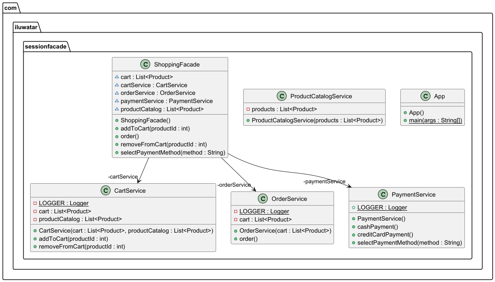

## Intent

Simplify the management process and boost performance by encapsulating business-tier components and expose a course-grained service access layer to remote clients.

## Class diagram

## Applicability
The session facade pattern is applicable when
* we want to limit the amount of business-tier components that are made available to the clients through the remote access layer
* we want to offer a cleaner interface to the clients by concealing the intricate interactions among the business components and
* we want to centralize business logic to gain better manageability and greater flexibility.

## Related patterns
* [Facade Pattern](https://java-design-patterns.com/patterns/facade/)

## Credits
* [J2EE Design Patterns](https://www.oreilly.com/library/view/j2ee-design-patterns/0596004273/re29.html)
* [Core J2EE Patterns](https://www.oracle.com/java/technologies/session-facade.html)
