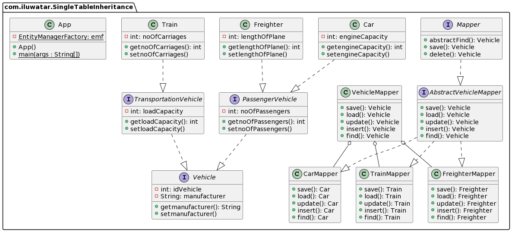

## Intent

Map all the fields of classes in an inheritance hierarchy into a single table

##Explanation
A relational database doesn't support inheritance, therefore when we process inherited classes, there tend to be significant numbers of join operations. Single Table Inheritance ensures that all classes in the hierarchy are mapped to the same table.
Single Table Inheritance ensure that all class in the hierarchy is map to the same table

## Class diagram



## Programmatic Example

Finding object in database
```java
    VehicleMapper vm = new VehicleMapper();
    Vehicle v = vm.find(1);//1 is the Vehicle id
```
Inserting new object into a database
```java
    VehicleMapper vm = new VehicleMapper();

    Car car = new Car();
    car.setManufacturer("Volkswagen");
    final int noOfPassengersCar = 4;
    final int engineCapacity = 1500;
    car.setNoOfPassengers(noOfPassengersCar);
    car.setEngineCapacity(engineCapacity);
    vm.insert(car);
```

Updating Object in database
```java
    VehicleMapper vm = new VehicleMapper();
    Train t = (Train) vm.find(t.getIdVehicle());
    t.setNoOfCarriages(20);
    vm.update(t);
```

Deleting Object in database
```java
    VehicleMapper vm = new VehicleMapper();
    Vehicle v = vm.find(1);//1 is the Vehicle id
    vm.delete(v)
```

Use the Single Table Inheritance pattern when

* mapping from objects to relational database without needing join to retrieve data

##Reference
https://www.martinfowler.com/eaaCatalog/singleTableInheritance.html

