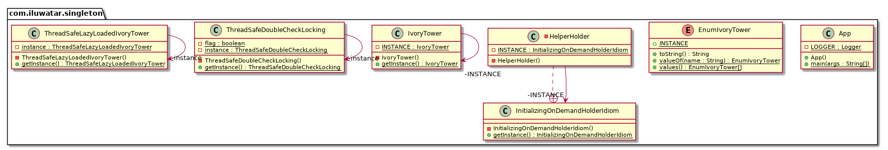

## Intent

Ensure a class only has one instance, and provide a global point of access to it.


## Explanation

Real world example

> There can only be one ivory tower where the wizards study their magic. The same enchanted ivory 
> tower is always used by the wizards. Ivory tower here is singleton.

In plain words

> Ensures that only one object of a particular class is ever created.

Wikipedia says

> In software engineering, the singleton pattern is a software design pattern that restricts the 
> instantiation of a class to one object. This is useful when exactly one object is needed to 
> coordinate actions across the system.

**Programmatic Example**

Joshua Bloch, Effective Java 2nd Edition p.18

> A single-element enum type is the best way to implement a singleton

```java
public enum EnumIvoryTower {
  INSTANCE
}
```

Then in order to use:

```java
var enumIvoryTower1 = EnumIvoryTower.INSTANCE;
var enumIvoryTower2 = EnumIvoryTower.INSTANCE;
assertEquals(enumIvoryTower1, enumIvoryTower2); // true
```

## Class diagram



## Applicability

Use the Singleton pattern when

* There must be exactly one instance of a class, and it must be accessible to clients from a well-known access point
* When the sole instance should be extensible by subclassing, and clients should be able to use an extended instance without modifying their code

## Typical Use Case

* The logging class
* Managing a connection to a database
* File manager

## Real world examples

* [java.lang.Runtime#getRuntime()](http://docs.oracle.com/javase/8/docs/api/java/lang/Runtime.html#getRuntime%28%29)
* [java.awt.Desktop#getDesktop()](http://docs.oracle.com/javase/8/docs/api/java/awt/Desktop.html#getDesktop--)
* [java.lang.System#getSecurityManager()](http://docs.oracle.com/javase/8/docs/api/java/lang/System.html#getSecurityManager--)


## Consequences

* Violates Single Responsibility Principle (SRP) by controlling their own creation and lifecycle.
* Encourages using a global shared instance which prevents an object and resources used by this object from being deallocated.     
* Creates tightly coupled code. The clients of the Singleton become difficult to test.
* Makes it almost impossible to subclass a Singleton.

## Credits

* [Design Patterns: Elements of Reusable Object-Oriented Software](https://www.amazon.com/gp/product/0201633612/ref=as_li_tl?ie=UTF8&camp=1789&creative=9325&creativeASIN=0201633612&linkCode=as2&tag=javadesignpat-20&linkId=675d49790ce11db99d90bde47f1aeb59)
* [Effective Java](https://www.amazon.com/gp/product/0134685997/ref=as_li_tl?ie=UTF8&camp=1789&creative=9325&creativeASIN=0134685997&linkCode=as2&tag=javadesignpat-20&linkId=4e349f4b3ff8c50123f8147c828e53eb)
* [Head First Design Patterns: A Brain-Friendly Guide](https://www.amazon.com/gp/product/0596007124/ref=as_li_tl?ie=UTF8&camp=1789&creative=9325&creativeASIN=0596007124&linkCode=as2&tag=javadesignpat-20&linkId=6b8b6eea86021af6c8e3cd3fc382cb5b)
* [Refactoring to Patterns](https://www.amazon.com/gp/product/0321213351/ref=as_li_tl?ie=UTF8&camp=1789&creative=9325&creativeASIN=0321213351&linkCode=as2&tag=javadesignpat-20&linkId=2a76fcb387234bc71b1c61150b3cc3a7)
