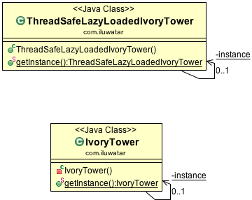

**Intent:** Ensure a class only has one instance, and provide a global point of
access to it.

**Applicability:** Use the Singleton pattern when

* there must be exactly one instance of a class, and it must be accessible to clients from a well-known access point
* when the sole instance should be extensible by subclassing, and clients should be able to use an extended instance without modifying their code

**Typical Use Case:**

* the logging class
* managing a connection to a database
* file manager

**Real world examples:**

* [java.lang.Runtime#getRuntime()](http://docs.oracle.com/javase/8/docs/api/java/lang/Runtime.html#getRuntime%28%29)
