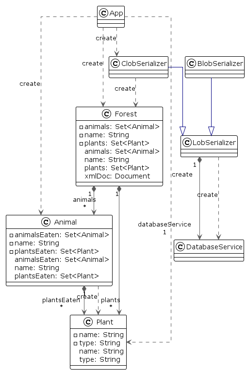

## Intent

* Object models often contain complicated graphs of small objects. Much of the information in these
  structures isn’t in the objects but in the links between them.
* Objects don’t have to be persisted as table rows related to each other.
* Another form of persistence is serialization, where a whole graph of objects is written out as a
  single large object (LOB) in a table.

## Explanation

**In plain words**

> The Forest here represents the object graph.
> A forest contains animals and plants. As is in real life the forest object contains plants and
> animals where some animals eat other animals and some eat only plants.
> * These relationships are maintained in the Forest Object.
> * There are 2 types of Serializers available ClobSerializer and BlobSerializer.
> * ClobSerializer uses character or textual based serialization, here the Object graph is converted
> * to XML and then stored as text in DB.
> * BlobSerializer uses binary data for serialization, here the Object graph is converted to Byte
> * Array and then stored as a blob in DB.

**Programmatic Example**

* Here is the `Animal` class. It represents the Animal object in the Forest. It contains the name of
  the animals in the forest and details of what they eat from the forest plants/animals or both.

```java
/**
 * Creates an object Forest which contains animals and plants as its constituents. Animals may eat
 * plants or other animals in the forest.
 */
@Data
@NoArgsConstructor
@AllArgsConstructor
public class Forest implements Serializable {

  private String name;
  private final Set<Animal> animals = new HashSet<>();
  private final Set<Plant> plants = new HashSet<>();

  /**
   * Provides the representation of Forest in XML form.
   *
   * @return XML Element
   */
  public Element toXmlElement() throws ParserConfigurationException {
    Document xmlDoc = getXmlDoc();

    Element forestXml = xmlDoc.createElement("Forest");
    forestXml.setAttribute("name", name);

    Element animalsXml = xmlDoc.createElement("Animals");
    for (Animal animal : animals) {
      Element animalXml = animal.toXmlElement(xmlDoc);
      animalsXml.appendChild(animalXml);
    }
    forestXml.appendChild(animalsXml);

    Element plantsXml = xmlDoc.createElement("Plants");
    for (Plant plant : plants) {
      Element plantXml = plant.toXmlElement(xmlDoc);
      plantsXml.appendChild(plantXml);
    }
    forestXml.appendChild(plantsXml);
    return forestXml;
  }

  /**
   * Returns XMLDoc to use for XML creation.
   *
   * @return XML DOC Object
   * @throws ParserConfigurationException {@inheritDoc}
   */
  private Document getXmlDoc() throws ParserConfigurationException {
    return DocumentBuilderFactory.newDefaultInstance().newDocumentBuilder().newDocument();
  }

  /**
   * Parses the Forest Object from the input XML Document.
   *
   * @param document the XML document from which the Forest is to be parsed
   */
  public void createObjectFromXml(Document document) {
    name = document.getDocumentElement().getAttribute("name");
    NodeList nodeList = document.getElementsByTagName("*");
    iterateXmlForAnimalAndPlants(nodeList, animals, plants);
  }

  @Override
  public String toString() {
    StringBuilder sb = new StringBuilder("\n");
    sb.append("Forest Name = ").append(name).append("\n");
    sb.append("Animals found in the ").append(name).append(" Forest: \n");
    for (Animal animal : animals) {
      sb.append("\n--------------------------\n");
      sb.append(animal.toString());
      sb.append("\n--------------------------\n");
    }
    sb.append("\n");
    sb.append("Plants in the ").append(name).append(" Forest: \n");
    for (Plant plant : plants) {
      sb.append("\n--------------------------\n");
      sb.append(plant.toString());
      sb.append("\n--------------------------\n");
    }
    return sb.toString();
  }
}
```

* Here is the `LobSerializer` abstract class. It provides the specification to serialize and
  deserialize the input object and persist and load that object into a DB.

```java
/**
 * A LobSerializer can be used to create an instance of a serializer which can serialize and
 * deserialize an object and persist and load that object into a DB. from their Binary
 * Representation.
 */
public abstract class LobSerializer implements Serializable, Closeable {

  private final transient DatabaseService databaseService;

  /**
   * Constructor initializes {@link LobSerializer#databaseService}.
   *
   * @param dataTypeDb Input provides type of Data to be stored by the Data Base Service
   * @throws SQLException If any issue occurs during instantiation of DB Service or during startup.
   */
  protected LobSerializer(String dataTypeDb) throws SQLException {
    databaseService = new DatabaseService(dataTypeDb);
    databaseService.startupService();
  }

  /**
   * Provides the specification to Serialize the input object.
   *
   * @param toSerialize Input Object to serialize
   * @return Serialized Object
   * @throws ParserConfigurationException if any issue occurs during parsing of input object
   * @throws TransformerException         if any issue occurs during Transformation
   * @throws IOException                  if any issues occur during reading object
   */
  public abstract Object serialize(Forest toSerialize)
      throws ParserConfigurationException, TransformerException, IOException;

  /**
   * Saves the object to DB with the provided ID.
   *
   * @param id     key to be sent to DB service
   * @param name   Object name to store in DB
   * @param object Object to store in DB
   * @return ID with which the object is stored in DB
   * @throws SQLException if any issue occurs while saving to DB
   */
  public int persistToDb(int id, String name, Object object) throws SQLException {
    databaseService.insert(id, name, object);
    return id;
  }

  /**
   * Loads the object from db using the ID and column name.
   *
   * @param id         to query the DB
   * @param columnName column from which object is to be extracted
   * @return Object from DB
   * @throws SQLException if any issue occurs while loading from DB
   */
  public Object loadFromDb(int id, String columnName) throws SQLException {
    return databaseService.select(id, columnName);
  }

  /**
   * Provides the specification to Deserialize the input object.
   *
   * @param toDeserialize object to deserialize
   * @return Deserialized Object
   * @throws ParserConfigurationException If issue occurs during parsing of input object
   * @throws IOException                  if any issues occur during reading object
   * @throws SAXException                 if any issues occur during reading object for XML parsing
   */
  public abstract Forest deSerialize(Object toDeserialize)
      throws ParserConfigurationException, IOException, SAXException, ClassNotFoundException;

  @Override
  public void close() {
    try {
      databaseService.shutDownService();
    } catch (SQLException e) {
      throw new RuntimeException(e);
    }
  }
}
```

* Here is the `ClobSerializer` class. It extends the `LobSerializer` abstract class and provides the
  implementation to serialize and deserialize the input object and persist and load that object into
  a DB using ClobSerializer.
* Objects are serialized using character or textual based serialization
  using XML to represent the object graph.

```java

/**
 * Creates a Serializer that uses Character based serialization and deserialization of objects graph
 * to and from XML Representation.
 */
public class ClobSerializer extends LobSerializer {

  public static final String TYPE_OF_DATA_FOR_DB = "TEXT";

  public ClobSerializer() {
    super(TYPE_OF_DATA_FOR_DB);
  }

  /**
   * Converts the input node to its XML String Representation.
   *
   * @param node XML Node that is to be converted to string
   * @return String representation of XML parsed from the Node
   * @throws TransformerException If any issues occur in Transformation from Node to XML
   */
  private static String elementToXmlString(Element node) throws TransformerException {
    StringWriter sw = new StringWriter();
    Transformer t = TransformerFactory.newDefaultInstance().newTransformer();
    t.setOutputProperty(OutputKeys.OMIT_XML_DECLARATION, "no");
    t.setOutputProperty(OutputKeys.INDENT, "yes");
    t.transform(new DOMSource(node), new StreamResult(sw));
    return sw.toString();
  }

  /**
   * Serializes the input object graph to its XML Representation using DOM Elements.
   *
   * @param forest Object which is to be serialized
   * @return Serialized object
   * @throws ParserConfigurationException If any issues occur in parsing input object
   * @throws TransformerException         If any issues occur in Transformation from Node to XML
   */
  @Override
  public Object serialize(Forest forest) throws ParserConfigurationException, TransformerException {
    Element xmlElement = forest.toXmlElement();
    return elementToXmlString(xmlElement);
  }

  /**
   * Deserializes the input XML string using DOM Parser and return its Object Graph Representation.
   *
   * @param toDeserialize Input Object to De-serialize
   * @return Deserialized Object
   * @throws ParserConfigurationException If any issues occur in parsing input object
   * @throws IOException                  if any issues occur during reading object
   * @throws SAXException                 If any issues occur in Transformation from Node to XML
   */
  @Override
  public Forest deSerialize(Object toDeserialize)
      throws ParserConfigurationException, IOException, SAXException {
    DocumentBuilder documentBuilder = DocumentBuilderFactory.newDefaultInstance()
        .newDocumentBuilder();
    var stream = new ByteArrayInputStream(toDeserialize.toString().getBytes());
    Document parsed = documentBuilder.parse(stream);
    Forest forest = new Forest();
    forest.createObjectFromXml(parsed);
    return forest;
  }
}
```

* Here is the `SlobSerializer` class. It extends the `LobSerializer` abstract class and provides the
  implementation to serialize and deserialize the input object and persist and load that object into
  a DB using ClobSerializer.
* Objects are serialized using binary data based serialization objects a persisted as a BINARY/BLOB
  in DB.

```java
/**
 * Creates a Serializer that uses Binary serialization and deserialization of objects graph to and
 * from their Binary Representation.
 */
public class BlobSerializer extends LobSerializer {

  public static final String TYPE_OF_DATA_FOR_DB = "BINARY";

  public BlobSerializer() throws SQLException {
    super(TYPE_OF_DATA_FOR_DB);
  }

  /**
   * Serializes the input object graph to its Binary Representation using Object Stream.
   *
   * @param toSerialize Object which is to be serialized
   * @return Serialized object
   * @throws IOException {@inheritDoc}
   */
  @Override
  public Object serialize(Forest toSerialize) throws IOException {
    ByteArrayOutputStream baos = new ByteArrayOutputStream();
    ObjectOutputStream oos = new ObjectOutputStream(baos);
    oos.writeObject(toSerialize);
    oos.close();
    return new ByteArrayInputStream(baos.toByteArray());
  }

  /**
   * Deserializes the input Byte Array Stream using Object Stream and return its Object Graph
   * Representation.
   *
   * @param toDeserialize Input Object to De-serialize
   * @return Deserialized Object
   * @throws ClassNotFoundException {@inheritDoc}
   * @throws IOException            {@inheritDoc}
   */
  @Override
  public Forest deSerialize(Object toDeserialize) throws IOException, ClassNotFoundException {
    InputStream bis = (InputStream) toDeserialize;
    Forest forest;
    try (ObjectInput in = new ObjectInputStream(bis)) {
      forest = (Forest) in.readObject();
    }
    return forest;
  }
}
```

## Class diagram



## Applicability

* This pattern works best when you can chop out a piece of the object model and use it to represent
  the LOB.
* Think of a LOB as a way to take a bunch of objects that aren’t likely to be queried from any SQL
  route outside the application.
* This graph can then be hooked into the SQL schema. Serialized LOB works poorly when you have
  objects outside the LOB reference objects buried in it.
* Serialized LOB isn’t considered as often as it might be. XML makes it much more attractive since
  it yields an easy-to-implement textual approach.
* Its main disadvantage is that you can’t query the structure using SQL.
* SQL extensions appear to get at XML data within a field, but that’s still not the same (or
  portable).

## Credits

* [Serialized LOB](https://martinfowler.com/eaaCatalog/serializedLOB.html) by Martin Fowler
