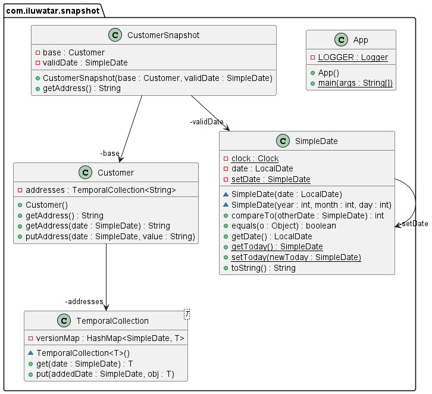

--- 
layout: pattern
title: Snapshot
folder: snapshot
permalink: /patterns/snapshot/
categories:
- creational 
language: en
tags:
- Data access
---

## Name / classification

Snapshot.

## Intent

Create a view of an object at a point in time.

## Explanation

Real world example

> A customer can have many details that change over time, and trying to keep track of these 
> values at any time can be difficult. Instead, make a snapshot of a customer, and work using 
> its variables, abstracting away the temporal component.

In plain words

> A snapshot is a copy of an object as it is at a point in time.

Martin Fowler says:

>A Snapshot is simply a view of an object with all the temporal aspects removed. So if the full 
> temporal object has an accessor in the form getAddress(date) then the snapshot will have an 
> accessor getAddress(). All questions of a snapshot are non-temporal.

**Programmatic Example**

In this example implementation, `Customer` is an object with Temporality on its current address, 
and `CustomerSnapshot` is the snapshot of `Customer`.

Here are the relevant parts of `Customer`

```java
public class Customer {
  private TemporalCollection<String> addresses = new TemporalCollection<>();

  public String getAddress(SimpleDate date) {
    return addresses.get(date);
  }

  public String getAddress() {
    return getAddress(SimpleDate.getToday());
  }

  public void putAddress(SimpleDate date, String value) {
    addresses.put(date, value);
  }
}
```

Here are the relavant portions of `CustomerSnapshot`,
```java
public class CustomerSnapshot {
  private Customer base;
  private SimpleDate validDate;

  public CustomerSnapshot(Customer base, SimpleDate validDate) {
    this.base = base;
    this.validDate = validDate;
  }

  public String getAddress() {
    return base.getAddress(validDate);
  }
}
```

Then, we introduce an example application that makes use of this
```java
  public static void main(String[] args) {
    Customer billy = new Customer();
    HashMap<SimpleDate, CustomerSnapshot> billySnapshots = new HashMap<>();

    // billy changes addresses a few times, and has snapshots taken occasionally.

    billy.putAddress(new SimpleDate(2004, 2, 4), "88 Worcester St");

    billySnapshots.put(new SimpleDate(2004, 3, 1),
    new CustomerSnapshot(billy, new SimpleDate(2004, 3, 1)));
    billySnapshots.put(new SimpleDate(2005, 5, 3),
    new CustomerSnapshot(billy, new SimpleDate(2005, 5, 3)));

    billy.putAddress(new SimpleDate(2005, 9, 2), "87 Franklin St");

    billySnapshots.put(new SimpleDate(2006, 2, 1),
    new CustomerSnapshot(billy, new SimpleDate(2006, 2, 1)));

    billy.putAddress(new SimpleDate(2007, 1, 2), "18 Circuit St");
    billySnapshots.put(new SimpleDate(2007, 1, 5),
    new CustomerSnapshot(billy, new SimpleDate(2006, 2, 1)));

    System.out.println("Snapshots of billy's address:");
    for (Map.Entry<SimpleDate, CustomerSnapshot> entry : billySnapshots.entrySet()) {
      System.out.println("On " + entry.getKey() + " billy was at " + entry.getValue().getAddress());
    }
  }
```

## Class diagram



## Applicability

Use the Snapshot pattern when
* You have an object with temporality and don't want to take that into 
account.

## Tutorials
* [Design Patterns - Memento Pattern](https://www.tutorialspoint.com/design_pattern/memento_pattern.htm)
 is a Snapshot tutorial as a Snapshot is a Memento without a caretaker.
  
## Known uses

* [java.util.Date](http://docs.oracle.com/javase/8/docs/api/java/util/Date.html)
 as Snapshot is a Memento without a caretaker.
## Consequences

Pros:
* Snapshots help to access values as temporality doesn't need to be considered after creation.

Note that Snapshots are equivalent to the Memento pattern without the caretaker.

## Related patterns
* [Memento](https://java-design-patterns.com/patterns/memento/)

## Credits
* [Martin Fowler](https://martinfowler.com/eaaDev/Snapshot.html)
