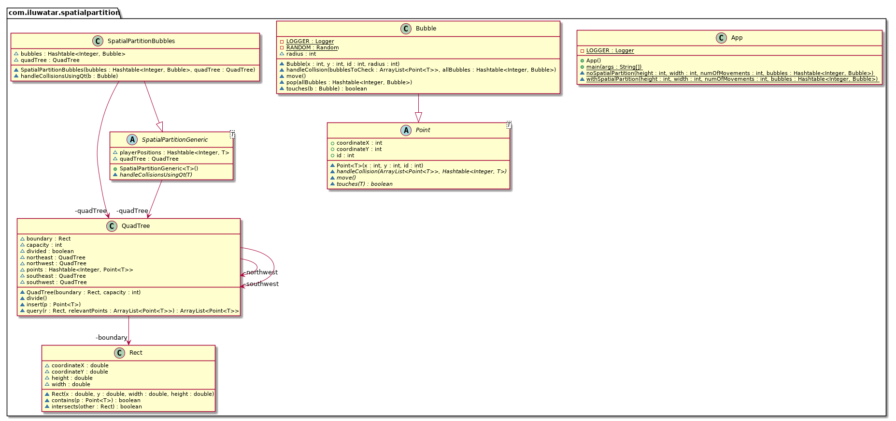

## Also known as

* Space Partitioning
* Spatial Indexing

## Intent

Efficiently organize a large number of objects in space to optimize queries and operations.

## Explanation

Real-world example

> Imagine managing a large warehouse where items are constantly being moved, added, or retrieved. To optimize the search for specific items and manage space efficiently, the warehouse is divided into different sections or zones. Each zone contains shelves, and each shelf holds a specific category of items.
>
> This setup is analogous to the Spatial Partition design pattern in software, where a large space (the warehouse) is divided into manageable parts (zones) to optimize operations like searching for an item or checking inventory (spatial queries). By organizing the warehouse this way, it becomes easier to locate and manage items, much like how spatial partitioning helps in efficiently managing and querying objects in a large spatial environment.

In plain words

> The Spatial Partition design pattern organizes objects in a defined space to optimize spatial queries and operations.

Wikipedia says

> The Spatial Partition design pattern, also known as Space Partitioning, involves dividing a space into non-overlapping regions to manage and query spatial data efficiently. This method is widely used in computer graphics, particularly for optimizing tasks like collision detection, ray tracing, and rendering large scenes with numerous objects. By organizing objects into hierarchical structures such as BSP trees, Quadtrees, or Octrees, spatial queries can be performed more efficiently, significantly reducing computational overhead.
>
> For example, in ray tracing, space partitioning helps quickly determine the objects a ray might intersect by narrowing down the search space, leading to faster rendering times. Similarly, in game development, Quadtrees can efficiently manage 2D game environments by segmenting the space into smaller regions, facilitating quicker collision detection and rendering.

**Programmatic Example**

The Spatial Partition design pattern is a way to handle objects in a large space, such as a game world or a simulation environment. It allows us to efficiently manage these objects and perform operations like collision detection or range queries. The pattern works by dividing the space into smaller, manageable regions, and each object is associated with the region it belongs to. This way, we can limit our operations to a specific region, instead of checking every object against every other object.

In the provided code, we have an example of a war game where the positions of players are updated every frame. The simple way to handle interactions on the battlefield is to check each player's position against every other player's position. However, this approach includes a lot of unnecessary checks between players who are too far apart to influence each other. The Spatial Partition pattern can help us optimize this operation.

Here's a simplified version of the code with added comments to explain the Spatial Partition pattern:

```java
// This is the simple way to handle interactions on the battlefield
// It includes a lot of unnecessary checks between players who are too far apart to influence each other
public void handleMeLee(Unit units[], int numUnits) {
    for (var a = 0; a < numUnits - 1; a++) {
        for (var b = a + 1; b < numUnits; b++) {
            // We check if two units are at the same position
            if (units[a].position() == units[b].position()) {
                // If they are, we handle the attack
                handleAttack(units[a], units[b]);
            }
        }
    }
}
```

The above code has a time complexity of O(n^2), which can be quite inefficient when the number of units is large. The Spatial Partition pattern can help us reduce this complexity.

In the Spatial Partition pattern, we would divide the battlefield into smaller regions, and each unit would be associated with the region it belongs to. When we need to check for interactions, we would only need to check the units within the same region, significantly reducing the number of checks.

Here's a simplified version of how this might look:

```java
// We first create a spatial partition (e.g., a grid or a quadtree)
SpatialPartition partition = new SpatialPartition();

// We then add each unit to the partition
for (Unit unit : units) {
    partition.add(unit);
}

// When we need to handle interactions, we only check the units within the same region
for (Unit unit : units) {
    List<Unit> nearbyUnits = partition.getUnitsInSameRegion(unit);
    for (Unit nearbyUnit : nearbyUnits) {
        if (unit.position() == nearbyUnit.position()) {
            handleAttack(unit, nearbyUnit);
        }
    }
}
```

In this code, `SpatialPartition` is a class that represents the spatial partition. The `add` method is used to add a unit to the partition, and the `getUnitsInSameRegion` method is used to get all units in the same region as a given unit. The exact implementation of these methods would depend on the specific type of spatial partition used (e.g., grid, quadtree, etc.).

This way, we can reduce the time complexity of finding the units within a certain range from O(n^2) to O(nlogn), decreasing the computations required significantly in case of a large number of units.

## Class diagram



## Applicability

* Use when managing a large number of objects in a spatial environment, such as in games or simulations.
* Useful for optimizing spatial queries like finding nearby objects or detecting collisions.

## Tutorials

* [Coding Challenge #98.1: Quadtree - Part 1 (The Coding Train)](https://www.youtube.com/watch?v=OJxEcs0w_kE)

## Known Uses

* Quadtree in 2D games for collision detection.
* Octree in 3D environments for rendering and physics calculations.
* KD-tree in spatial databases for efficient range searches.

## Consequences

Benefits:

* Significant performance improvements in spatial queries.
* Reduces the complexity of managing objects in large spaces.
* Scales well with an increasing number of objects.

Trade-offs:

* Increased complexity in implementation.
* May require periodic rebalancing or restructuring as objects move.

## Related Patterns

* [Composite](https://java-design-patterns.com/patterns/composite/): Helps manage hierarchical data structures like trees used in spatial partitioning.
* [Flyweight](https://java-design-patterns.com/patterns/flyweight/): Can be used to manage memory efficiently for objects stored in spatial partitions.

## Credits

* [Game Programming Patterns](https://amzn.to/3K96fOn)
* [Introduction to Algorithms](https://amzn.to/4aC5hW0)
* [Real-Time Collision Detection](https://amzn.to/4as9gnW)
* [Spatial Partition (Game Programming Patterns)](http://gameprogrammingpatterns.com/spatial-partition.html)
