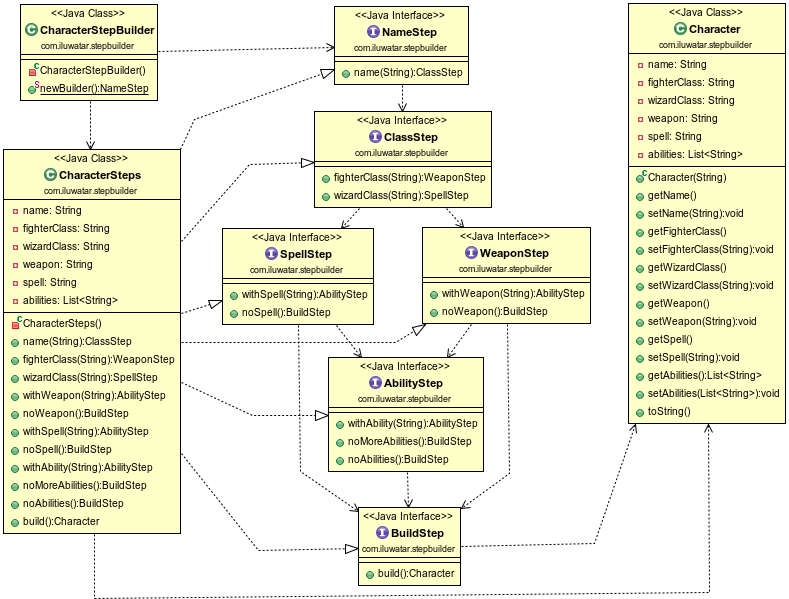

## Intent
An extension of the Builder pattern that fully guides the user through the creation of the object with no chances of confusion.
The user experience will be much more improved by the fact that he will only see the next step methods available, NO build method until is the right time to build the object.

## Applicability
Use the Step Builder pattern when the algorithm for creating a complex object should be independent of the parts that make up the object and how they're assembled the construction process must allow different representations for the object that's constructed when in the process of constructing the order is important.

## Credits

* [Marco Castigliego - Step Builder](http://rdafbn.blogspot.co.uk/2012/07/step-builder-pattern_28.html)
