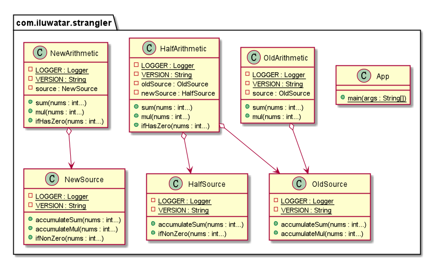

## Intent
Incrementally migrate a legacy system by gradually replacing specific pieces of functionality
with new applications and services. As features from the legacy system are replaced, the new
system eventually covers all the old system's features and may has its own new features, then
strangling the old system and allowing you to decommission it.

## Class diagram

## Applicability
This strangler pattern is a safe way to phase one thing out for something better, cheaper, or 
more expandable. Especially when you want to update legacy system with new techniques and need 
continuously develop new features at the same time. Note that this pattern indeed need extra effort, 
so usually use it when the system is not so simple.

## Credits

* [Strangler pattern](https://docs.microsoft.com/en-us/azure/architecture/patterns/strangler)
* [Legacy Application Strangulation : Case Studies](https://paulhammant.com/2013/07/14/legacy-application-strangulation-case-studies/)
