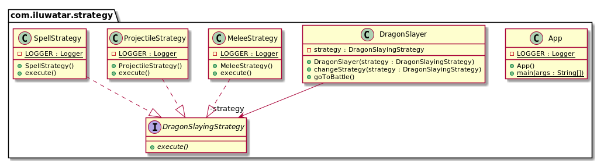

## Also known as

* Policy

## Intent

Define a family of algorithms, encapsulate each one, and make them interchangeable. Strategy lets the algorithm vary independently of the clients that use it.

## Explanation

Real-world example

> An analogous real-world example of the Strategy design pattern is the navigation systems in cars. Different navigation algorithms (such as shortest route, fastest route, and scenic route) can be used to determine the best path from one location to another. Each algorithm encapsulates a specific strategy for calculating the route. The user (client) can switch between these algorithms based on their preferences without changing the navigation system itself. This allows for flexible and interchangeable navigation strategies within the same system. 

In plain words

> Strategy pattern allows choosing the best-suited algorithm at runtime.

Wikipedia says

> In computer programming, the strategy pattern (also known as the policy pattern) is a behavioral software design pattern that enables selecting an algorithm at runtime.

**Programmatic Example**

Slaying dragons is a dangerous job. With experience, it becomes easier. Veteran dragonslayers have developed different fighting strategies against different types of dragons.

Let's first introduce the dragon-slaying strategy interface and its implementations.

```java
@FunctionalInterface
public interface DragonSlayingStrategy {

  void execute();
}

@Slf4j
public class MeleeStrategy implements DragonSlayingStrategy {

  @Override
  public void execute() {
    LOGGER.info("With your Excalibur you sever the dragon's head!");
  }
}

@Slf4j
public class ProjectileStrategy implements DragonSlayingStrategy {

  @Override
  public void execute() {
    LOGGER.info("You shoot the dragon with the magical crossbow and it falls dead on the ground!");
  }
}

@Slf4j
public class SpellStrategy implements DragonSlayingStrategy {

  @Override
  public void execute() {
    LOGGER.info("You cast the spell of disintegration and the dragon vaporizes in a pile of dust!");
  }
}
```

And here is the mighty dragonslayer, who can pick his fighting strategy based on the opponent.

```java
public class DragonSlayer {

  private DragonSlayingStrategy strategy;

  public DragonSlayer(DragonSlayingStrategy strategy) {
    this.strategy = strategy;
  }

  public void changeStrategy(DragonSlayingStrategy strategy) {
    this.strategy = strategy;
  }

  public void goToBattle() {
    strategy.execute();
  }
}
```

Finally, here's the dragonslayer in action.

```java
    LOGGER.info("Green dragon spotted ahead!");
    var dragonSlayer = new DragonSlayer(new MeleeStrategy());
    dragonSlayer.goToBattle();
    LOGGER.info("Red dragon emerges.");
    dragonSlayer.changeStrategy(new ProjectileStrategy());
    dragonSlayer.goToBattle();
    LOGGER.info("Black dragon lands before you.");
    dragonSlayer.changeStrategy(new SpellStrategy());
    dragonSlayer.goToBattle();
```

Program output:

```
    Green dragon spotted ahead!
    With your Excalibur you sever the dragon's head!
    Red dragon emerges.
    You shoot the dragon with the magical crossbow and it falls dead on the ground!
    Black dragon lands before you.
    You cast the spell of disintegration and the dragon vaporizes in a pile of dust!    
```

## Class diagram



## Applicability

Use the Strategy pattern when:

* You need to use different variants of an algorithm within an object and want to switch algorithms at runtime.
* There are multiple related classes that differ only in their behavior.
* An algorithm uses data that clients shouldn't know about.
* A class defines many behaviors and these appear as multiple conditional statements in its operations.

## Tutorial

* [Strategy Pattern Tutorial - Digital Ocean](https://www.digitalocean.com/community/tutorials/strategy-design-pattern-in-java-example-tutorial)

## Known Uses

* Java's `java.util.Comparator` interface is a common example of the Strategy pattern.
* In GUI frameworks, layout managers (such as those in Java's AWT and Swing) are strategies.

## Consequences

Benefits:

* Families of related algorithms are reused.
* An alternative to subclassing for extending behavior.
* Avoids conditional statements for selecting desired behavior.
* Allows clients to choose algorithm implementation.

Trade-offs:

* Clients must be aware of different Strategies.
* Increase in the number of objects.

## Related patterns

* [State](https://java-design-patterns.com/patterns/state/): Similar in structure but used to represent state-dependent behavior rather than interchangeable algorithms.
* [Decorator](https://java-design-patterns.com/patterns/decorator/): Enhances an object without changing its interface but is more concerned with responsibilities than algorithms.

## Credits

* [Design Patterns: Elements of Reusable Object-Oriented Software](https://amzn.to/3w0pvKI)
* [Functional Programming in Java](https://amzn.to/3JUIc5Q)
* [Head First Design Patterns: Building Extensible and Maintainable Object-Oriented Software](https://amzn.to/49NGldq)
* [Patterns of Enterprise Application Architecture](https://amzn.to/3WfKBPR)
* [Refactoring to Patterns](https://amzn.to/3VOO4F5)
