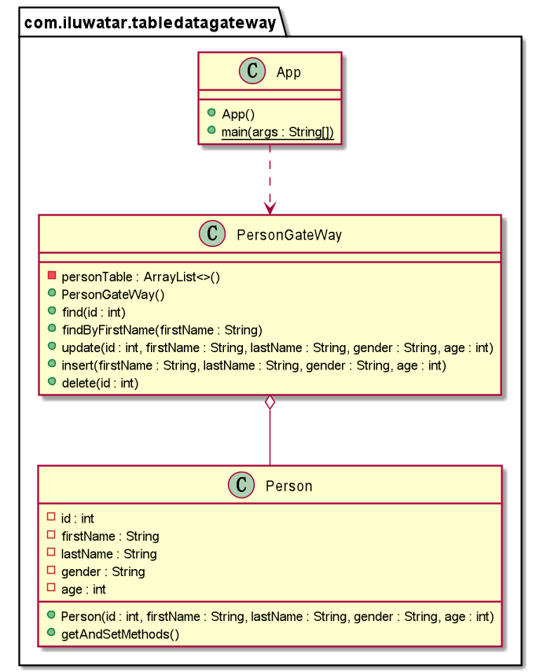

---  
layout: pattern  
title: Table Data Gateway
folder: table-data-gateway 
permalink: /patterns/table-data-gateway/  
categories: Behavioral
tags:
- Database
---  

## Intent
Table Data Gateway is a design pattern in which an object acts as a gateway to a database table. The idea is to separate the responsibility of fetching items from a database from the actual usages of those objects. Users of the gateway are then insulated from changes to the way objects are stored in the database.
## Class diagram

## Applicability
Mixing SQL in application logic can cause several problems. Many developers aren't comfortable with SQL, and many who are comfortable may not write it well. Database administrators need to be able to find SQL easily so they can figure out how to tune and evolve the database.

-   A Table Data Gateway holds all the SQL for accessing a single table or view: selects, inserts, updates, and deletes. Other code calls its methods for all interaction with the database.
-   Table Data Gateway is probably the simplest database interface pattern to use, as it maps so nicely onto a database table or record type. It also makes a natural point to encapsulate the precise access logic of the data source.

## Credits

* [Table Data Gateway Pattern-1]([https://www.sourcecodeexamples.net/2018/04/table-data-gateway.html](https://www.sourcecodeexamples.net/2018/04/table-data-gateway.html))
* [Table Data Gateway Pattern-2]([https://www.martinfowler.com/eaaCatalog/tableDataGateway.html](https://www.martinfowler.com/eaaCatalog/tableDataGateway.html))
