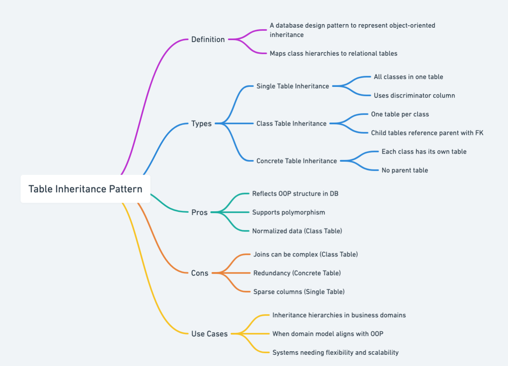

## Also known as

* Class Table Inheritance
* Joined Table Inheritance

## Intent of Table Inheritance Pattern

Represent inheritance hierarchies in relational databases by mapping each class in a hierarchy to a database table.

## Detailed Explanation of Table Inheritance Pattern with Real-World Examples

Real-world example

> A classic real-world analogy for the Table Inheritance (Joined Table) pattern is managing employee records in an organization: 
> Imagine a company's database storing information about employees. All employees have common attributes (name, employee ID, hire date), stored in a general "Employee" table. However, the company also has different types of employees: Full-time Employees (with a salary and benefits) and Contractors (hourly rate, contract duration). Each employee type has distinct data stored in separate specialized tables ("FullTimeEmployee" and "Contractor"), which reference the main "Employee" table. 
> This structure mirrors the Table Inheritance pattern—shared fields in a common table and unique fields split into subclass-specific tables.

In plain words

> The Table Inheritance pattern maps each class within an inheritance hierarchy to its own database table, storing common attributes in a base table and subclass-specific attributes in separate joined tables.

Martin Fowler says

> Relational databases don't support inheritance, which creates a mismatch when mapping objects. To fix this, Table Inheritance uses a separate table for each class in the hierarchy while maintaining relationships through foreign keys, making it easier to link the classes together in the database.

Mind map



## Programmatic Example of Table Inheritance Pattern in Java

The `Vehicle` class will be the superclass, and we will have subclasses `Car` and `Truck` that extend `Vehicle`. The superclass `Vehicle` stores common attributes, while subclasses store their own specific attributes.

### Key Aspects of the Pattern:

**Superclass (`Vehicle`):**

The superclass stores shared attributes:

* `make`: Manufacturer of the vehicle.
* `model`: Model of the vehicle.
* `year`: Year of manufacture.
* `id`: Unique identifier for the vehicle.

These common attributes will reside in a dedicated database table (`Vehicle` table).

**Subclasses (`Car` and `Truck`):**

Each subclass adds attributes specific to its type:

* `Car`: `numberOfDoors`, indicating how many doors the car has.
* `Truck`: `payloadCapacity`, representing how much payload the truck can carry.

Each subclass stores these specific attributes in their respective tables (`Car` and `Truck` tables).

**Foreign Key Relationship:**

Each subclass table references the superclass table via a foreign key. The subclass's `id` links to the primary key of the superclass, thus connecting common and subclass-specific data.

### Java Implementation Using JPA Annotations:

```java
@Setter
@Getter
public class Vehicle {

   private String make;
   private String model;
   private int year;
   private int id;

   public Vehicle(int year, String make, String model, int id) {
      this.make = make;
      this.model = model;
      this.year = year;
      this.id = id;
   }

   @Override
   public String toString() {
      return "Vehicle{"
              + "id="
              + id
              + ", make='"
              + make
              + '\''
              + ", model='"
              + model
              + '\''
              + ", year="
              + year
              + '}';
   }
}

@Getter
public class Car extends Vehicle {
   private int numDoors;

   public Car(int year, String make, String model, int numDoors, int id) {
      super(year, make, model, id);
      if (numDoors <= 0) {
         throw new IllegalArgumentException("Number of doors must be positive.");
      }
      this.numDoors = numDoors;
   }

   public void setNumDoors(int doors) {
      if (doors <= 0) {
         throw new IllegalArgumentException("Number of doors must be positive.");
      }
      this.numDoors = doors;
   }

   @Override
   public String toString() {
      return "Car{"
              + "id="
              + getId()
              + ", make='"
              + getMake()
              + '\''
              + ", model='"
              + getModel()
              + '\''
              + ", year="
              + getYear()
              + ", numberOfDoors="
              + getNumDoors()
              + '}';
   }
}

@Getter
public class Truck extends Vehicle {
   private double loadCapacity;

   public Truck(int year, String make, String model, double loadCapacity, int id) {
      super(year, make, model, id);
      if (loadCapacity <= 0) {
         throw new IllegalArgumentException("Load capacity must be positive.");
      }
      this.loadCapacity = loadCapacity;
   }

   public void setLoadCapacity(double capacity) {
      if (capacity <= 0) {
         throw new IllegalArgumentException("Load capacity must be positive.");
      }
      this.loadCapacity = capacity;
   }

   @Override
   public String toString() {
      return "Truck{"
              + "id="
              + getId()
              + ", make='"
              + getMake()
              + '\''
              + ", model='"
              + getModel()
              + '\''
              + ", year="
              + getYear()
              + ", payloadCapacity="
              + getLoadCapacity()
              + '}';
   }
}
```

### Explanation of the JPA annotations used above:

* `@Entity`: Indicates that the class is a JPA entity mapped to a database table.
* `@Inheritance(strategy = InheritanceType.JOINED)`: Configures joined table inheritance, meaning each class (superclass and subclasses) maps to its own table.
* `@Table(name = "XYZ")`: Explicitly specifies the database table name for clarity.
* `@Id`: Marks the primary key of the entity.
* `@GeneratedValue(strategy = GenerationType.IDENTITY)`: Specifies auto-generation of primary key values by the database.

### Database Structure Result:

Applying this code will result in three database tables structured as follows:

**Vehicle table**
* id
* make
* model
* year

**Car table**
* id (FK to Vehicle)
* numberOfDoors

**Truck table**
* id (FK to Vehicle)
* payloadCapacity

This approach clearly represents the Table Inheritance (Joined Table) pattern, with common attributes centrally managed in the superclass table and subclass-specific attributes cleanly separated in their own tables.

## When to Use the Table Inheritance Pattern in Java

* When persisting an inheritance hierarchy of Java classes in a relational database.
* Suitable when classes share common attributes but also have distinct fields.
* Beneficial when polymorphic queries across subclasses are frequent.

## Table Inheritance Pattern Java Tutorials

- [Software Patterns Lexicon: Class Table Inheritance](https://softwarepatternslexicon.com/patterns-sql/4/4/2/)
- [Martin Fowler: Class Table Inheritance](http://thierryroussel.free.fr/java/books/martinfowler/www.martinfowler.com/isa/classTableInheritance.html)

## Real-World Applications of Table Inheritance Pattern in Java

* Hibernate ORM (`@Inheritance(strategy = InheritanceType.JOINED)` in Java)
* EclipseLink (Joined Inheritance strategy in JPA)
* Spring Data JPA applications modeling complex domain hierarchies.

## Benefits and Trade-offs of Table Inheritance Pattern

Benefits:

 * Normalized database schema reduces redundancy.
 * Clearly models class hierarchies at the database level.
 * Easier to implement polymorphic queries due to clear class distinctions.

Trade-offs:

 * Increased complexity in database queries involving multiple joins.
 * Reduced performance for deep inheritance hierarchies due to costly joins.
 * Maintenance overhead increases with the complexity of inheritance structures.

## Related Java Design Patterns

* [Single Table Inheritance](https://java-design-patterns.com/patterns/single-table-inheritance/): Alternative strategy mapping an entire class hierarchy into a single database table, useful when fewer joins are preferred at the cost of nullable columns.
* Concrete Table Inheritance – Each subclass has its own standalone table; related in providing an alternate approach to storing inheritance hierarchies.

## References and Credits

* [Java Persistence with Hibernate](https://amzn.to/44tP1ox)
* [Object-Relational Mapping (Wikipedia)](https://en.wikipedia.org/wiki/Object-relational_mapping)
* [Patterns of Enterprise Application Architecture](https://amzn.to/3WfKBPR)
* [Pro JPA 2: Mastering the Java Persistence API](https://amzn.to/4b7UoMC)
