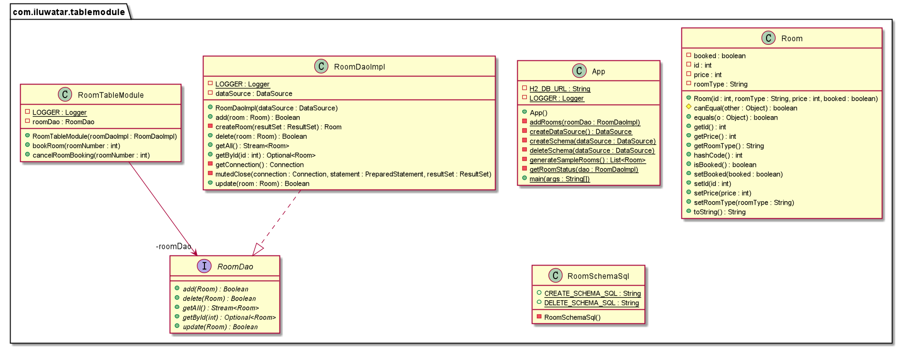

## Intent
Table Module organizes domain logic with one class per table in the database, and a single instance of a class contains the various procedures that will act on the data.

## Explanation

Real world example

> When dealing with a user system, we need some operations on the user table. We can use the table module pattern in this scenario. We can create a class named UserTableModule and initialize a instance of that class to handle the business logic for all rows in the user table.

In plain words

> A single instance that handles the business logic for all rows in a database table or view.

Programmatic Example

In the example of the user system, we need to deal with the domain logic of user login and user registration. We can use the table module pattern and create an instance of the class `UserTableModule` to handle the business logic for all rows in the user table.

Here is the basic `User` entity.

```java
@Setter
@Getter
@ToString
@EqualsAndHashCode
@AllArgsConstructor
public class User {
  private int id;
  private String username;
  private String password;
}
```

Here is the `UserTableModule` class.

```java
public class UserTableModule {
  private final DataSource dataSource;
  private Connection connection = null;
  private ResultSet resultSet = null;
  private PreparedStatement preparedStatement = null;

  public UserTableModule(final DataSource userDataSource) {
    this.dataSource = userDataSource;
  }
  
  /**
   * Login using username and password.
   *
   * @param username the username of a user
   * @param password the password of a user
   * @return the execution result of the method
   * @throws SQLException if any error
   */
  public int login(final String username, final String password) throws SQLException {
  		// Method implementation.

  }

  /**
   * Register a new user.
   *
   * @param user a user instance
   * @return the execution result of the method
   * @throws SQLException if any error
   */
  public int registerUser(final User user) throws SQLException {
  		// Method implementation.
  }
}
```

In the class `App`, we use an instance of the `UserTableModule` to handle user login and registration.

```java
// Create data source and create the user table.
final var dataSource = createDataSource();
createSchema(dataSource);
userTableModule = new UserTableModule(dataSource);

//Initialize two users.
var user1 = new User(1, "123456", "123456");
var user2 = new User(2, "test", "password");

//Login and register using the instance of userTableModule.
userTableModule.registerUser(user1);
userTableModule.login(user1.getUsername(), user1.getPassword());
userTableModule.login(user2.getUsername(), user2.getPassword());
userTableModule.registerUser(user2);
userTableModule.login(user2.getUsername(), user2.getPassword());

deleteSchema(dataSource);
```

The program output:

```java
12:22:13.095 [main] INFO com.iluwatar.tablemodule.UserTableModule - Register successfully!
12:22:13.117 [main] INFO com.iluwatar.tablemodule.UserTableModule - Login successfully!
12:22:13.128 [main] INFO com.iluwatar.tablemodule.UserTableModule - Fail to login!
12:22:13.136 [main] INFO com.iluwatar.tablemodule.UserTableModule - Register successfully!
12:22:13.144 [main] INFO com.iluwatar.tablemodule.UserTableModule - Login successfully!
```

## Class diagram



## Applicability

Use the Table Module Pattern when

- Domain logic is simple and data is in tabular form.
- The application only uses a few shared common table-oriented data structures.

## Related patterns

- [Transaction Script](https://java-design-patterns.com/patterns/transaction-script/)

- Domain Model

## Credits

* [Table Module Pattern](http://wiki3.cosc.canterbury.ac.nz/index.php/Table_module_pattern)
* [Patterns of Enterprise Application Architecture](https://www.amazon.com/gp/product/0321127420/ref=as_li_qf_asin_il_tl?ie=UTF8&tag=javadesignpat-20&creative=9325&linkCode=as2&creativeASIN=0321127420&linkId=18acc13ba60d66690009505577c45c04)
* [Architecture patterns: domain model and friends](https://inviqa.com/blog/architecture-patterns-domain-model-and-friends)