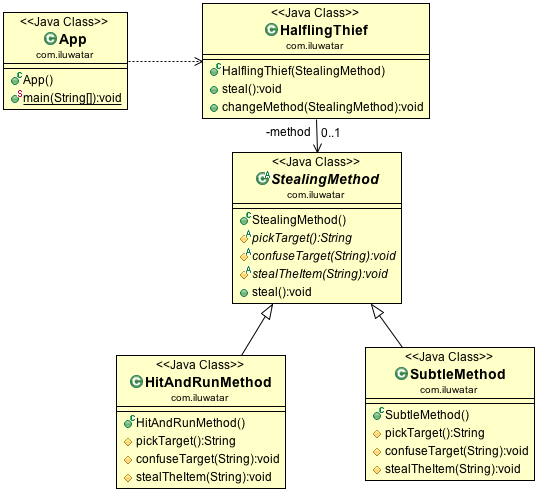

## Intent
Define the skeleton of an algorithm in an operation, deferring some
steps to subclasses. Template method lets subclasses redefine certain steps of
an algorithm without changing the algorithm's structure.

## Applicability
The Template Method pattern should be used

* to implement the invariant parts of an algorithm once and leave it up to subclasses to implement the behavior that can vary
* when common behavior among subclasses should be factored and localized in a common class to avoid code duplication. This is good example of "refactoring to generalize" as described by Opdyke and Johnson. You first identify the differences in the existing code and then separate the differences into new operations. Finally, you replace the differing code with a template method that calls one of these new operations
* to control subclasses extensions. You can define a template method that calls "hook" operations at specific points, thereby permitting extensions only at those points

## Tutorial
* [Template-method Pattern Tutorial](https://www.journaldev.com/1763/template-method-design-pattern-in-java)

## Credits

* [Design Patterns: Elements of Reusable Object-Oriented Software](http://www.amazon.com/Design-Patterns-Elements-Reusable-Object-Oriented/dp/0201633612)
