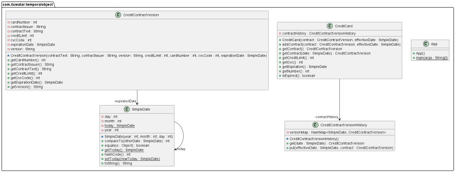

--- 
layout: pattern
title: Temporal Object
folder: temporal-object 
permalink: /patterns/temporal-object /
categories:
- creational 
language: en
tags:
- Data Access 
---

## Name / classification

Temporal Object.

## Also known as

Version History.

## Intent

Describing an object that changes over time.

## Explanation

Real-world example

> A person has a credit card, but the contract associated can change over time, and in fact, the 
> contract determines most of the details about the card. So, the credit card can be considered 
> a temporal object, with the contract being Temporal.

In plain word

> An object is largely determined by Temporal attributes, with a history associated to the 
> versions as they change. 

Martin Fowler says

>This pattern is very common, yet appears in a number of forms. To help grapple with these forms,
> I find it very helpful to use some role analysis. The pattern essentially has two roles: one 
> continuity and several versions.
>
> Each version captures the state of the object for some period of time. Any time the value of any 
> property of the object changes, you get a new version. Thus you can imagine the versions as a 
> list of objects with an Effectivity to handle the date range.  
>
>The continuity represents the on going object that goes through these changes in version. It's 
> the object people refer to when they are thinking of the object throughout its changes.

**Programatic Example**

In this example implementation, `CreditCard`s have contracts that change over time, and most of 
the card's properties are determined by the contract. 

Here are the relevant parts of the card, note that there are no variables set, and only a 
history in this example.

```java
public class CreditCard {
  private final TemporalCollection<CreditContractVersion> contractHistory;

  public CreditCard(CreditContractVersion contract, SimpleDate effectiveDate) {
    contractHistory = new TemporalCollection<>();
    contractHistory.put(effectiveDate, contract);
  }
  
  public CreditContractVersion getContract(SimpleDate date) {
    return contractHistory.get(date);
  }
  
  public void addContract(CreditContractVersion contract, SimpleDate effectiveDate) {
    contractHistory.put(effectiveDate, contract);
  }

  public boolean isExpired() {
    return getContract().getExpirationDate().compareTo(SimpleDate.getToday()) < 0;
  }

  public int getNumber() {
    return getContract().getCardNumber();
  }
}
```

Each `CreditContractVersion` consists of many variables, with the relevant parts

```java 
public class CreditContractVersion {
  private final String contractText;
  private final String contractIssuer;
  private final String version;
  private final int creditLimit;
  private final int cardNumber;
  private final int cvcCode;
  private final SimpleDate expirationDate;
}
```

Then, we can introduce an example application that makes use of these properties

```java
public static void main(String[] args) {
  SimpleDate.setToday(new SimpleDate(2000, 3, 1));

  // start a credit card contract from today until 3rd of September 2002
  CreditContractVersion firstContract = new CreditContractVersion("Original Contract",
  "Bank of XYZ", "Version 1", 100, 12345, 1234,
  new SimpleDate(2002, 9, 3));
  CreditCard card = new CreditCard(firstContract, SimpleDate.getToday());
  LOGGER.info("New card with limit of " + card.getCreditLimit() + ", card number "
  + card.getNumber() + ", and cvc code of " + card.getCvc() + " which expires on "
  + card.getExpiration());

  // The card expires
  SimpleDate.setToday(new SimpleDate(2002, 9, 18));
  LOGGER.info(SimpleDate.getToday().toString() + " is expired: " + card.isExpired());

  // And is then re-negotiated, with the new contract coming into effect a few days later

  CreditContractVersion secondContract = new CreditContractVersion("new contract", "Bank of XYZ",
  "Version 2", 120, 12345, 1234, new SimpleDate(2004, 3, 4));
  card.addContract(secondContract, new SimpleDate(2002, 9, 21));

  // A few days later when the new contract is effective
  SimpleDate.setToday(new SimpleDate(2002, 9, 21));
  LOGGER.info("Re-negotiated card with limit of " + card.getCreditLimit() + ", card number "
  + card.getNumber() + ", and cvc code of " + card.getCvc() + " which expires on "
  + card.getExpiration());
  LOGGER.info(SimpleDate.getToday().toString() + " is expired: " + card.isExpired());
}
```

Which has an output of 

```
New card with limit of 100, card number 12345, and cvc code of 1234 which expires on 2002-09-03
2002-09-18 is expired: true
Re-negotiated card with limit of 120, card number 12345, and cvc code of 1234 which expires on 2004-03-04
2002-09-21 is expired: false
```


## Class diagram



## Applicability

Use the Temporal Object pattern when
* Most of the objects properties are temporal.

## Consequences

A temporal object allows for individuals to explicitly refer to versions, and temporal objects 
don't necessarily need their users to be aware of the temporal aspect.

## Related patterns
[Temporal Property](https://martinfowler.com/eaaDev/TemporalProperty.html)
[Effectivity](https://martinfowler.com/eaaDev/Effectivity.html)
[Snapshot](https://martinfowler.com/eaaDev/Snapshot.html)

## Credits
[Martin Fowler](https://martinfowler.com/eaaDev/TemporalObject.html)