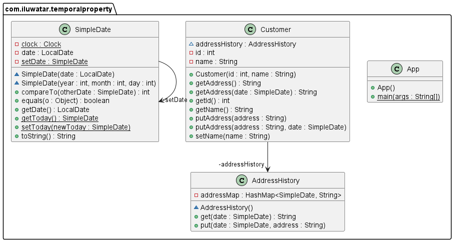

--- 
layout: pattern 
title: Temporal Property
folder: temporal-property
permalink: /patterns/temporal-property/
categories:
- creational 
  language: en 
  tags:
- Data Access
---

## Name / classification

Temporal Property.

## Also known as
Historic Mapping, History on Association.

## Intent

Have a small proportion of attributes in an object that change over time.

## Explanation

Real-world example
> A person's address changes over time, so there is a history of the person changing their 
> address over time.

In plain words
> A small proportions of attributes are temporal, and are stored with a date-based history.  

Martin Fowler says
> The key to this pattern is providing a regular and predictable interface for dealing with 
> those properties of an object that change over time. The most important part of this lies in 
> the accessor functions. You will always see an accessor function that takes a Time Point as an 
> argument: this allows you to ask "what was Mr Fowler's address on 2 Feb 1998?". In addition 
> you'll usually see an accessor that takes no argument, this is a question about an address 
> according to some default, usually today.

**Programmatic Example**

## Class diagram

## Applicability

Use the temporal property design pattern when
* you have a class that has a few properties that display temporal behavior, and you want easy 
  access to those temporal values. 

## Consequences

Temporal properties are easy to access, and display temporality.
If most of the properties of the class are temporal, then a Temporal Object is needed instead.

## Related patterns

[Effectivity](https://martinfowler.com/eaaDev/Effectivity.html)
[Audit Log](https://martinfowler.com/eaaDev/AuditLog.html)
[Temporal Object](https://martinfowler.com/eaaDev/TemporalObject.html)

## Credits

[Temporal Property](https://martinfowler.com/eaaDev/TemporalProperty.html)