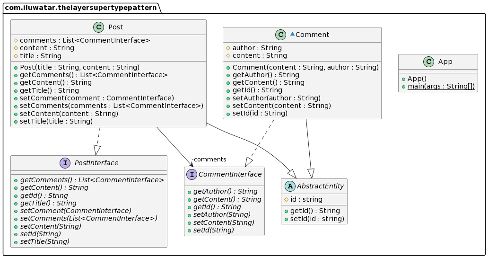

## Also known as

Kit

## Intent

The same properties or methods of different Entity objects are extracted upwards to reduce excessive repetitive code and provide abstraction capability, keeping simplicity and generality.

## Explanation

Real world example

> Pistol, rifle, sniper gun all have bullet specification properties, we can abstract a gun entity class has bullet specification properties, specific gun classes inherit from the gun entity class, all gun classes can refer to the bullet specification properties of the parent class

In plain words

> Abstracting similar subclasses, extracting common properties and methods and inheriting them, reducing the use of repetitive code

Wikipedia says

> It’s not uncommon for all the objects in a layer to have methods you don’t want to have duplicated throughout the system. You can move all of this behavior into a common Layer Supertype.

**Programmatic Example**

This is the common parent Entity entity of the Post and Comment classes


```java
public abstract class AbstractEntity {

    protected String id;

    public String getId() {
        return id;
    }

    public void setId(String id) {
        if(id == null || id.length() < 3) {
            throw new IllegalArgumentException("id length must gte 10");
        }
        this.id = id;
    }
}
```

This is the Post class and Comment entity

```java
public class Comment extends AbstractEntity implements CommentInterface {

    protected String content;
    protected String author;

    public Comment(String content, String author) {
        this.setContent(content);
        this.setAuthor(author);
    }

    @Override
    public void setId(String id) {
        if (this.getId() != null) {
            throw new IllegalArgumentException("The id for this comment has been set already.");
        }
        if (Integer.parseInt(id) < 1) {
            throw new IllegalArgumentException("The comment id must gte 1");
        }
        super.setId(id);
    }

    @Override
    public String getId() {
        return super.getId();
    }

    @Override
    public void setContent(String content) {
        if (content.length() < 2) {
            throw new IllegalArgumentException("The length of content must gte 2");
        }
        this.content = content;
    }

    @Override
    public String getContent() {
        return this.content;
    }

    @Override
    public void setAuthor(String author) {
        if (author.length() < 2) {
            throw new IllegalArgumentException("The length of author must gte 2");
        }
        this.author = author;
    }

    @Override
    public String getAuthor() {
        return this.author;
    }
}

public class Post extends AbstractEntity implements PostInterface {

    protected String title;
    protected String content;
    protected List<CommentInterface> comments = new ArrayList<>();

    /**
     * Post.
     *
     * @param title title
     * @param content content
     */
    public Post(String title, String content) {
        this.setTitle(title);
        this.setContent(content);
    }
    /**
     * @param title title.
     */
    @Override
    public void setTitle(String title) {
        if (title.length() < 2
                || title.length() > 100) {
            throw new IllegalArgumentException(
                    "The post title is invalid.");
        }
        this.title = title;
    }

    /**
     * @return title.
     */
    @Override
    public String getTitle() {
        return this.title;
    }

    /**
     * @param content content.
     */
    @Override
    public void setContent(String content) {
        if (content.length() < 2) {
            throw new IllegalArgumentException(
                    "The post content is invalid.");
        }
        this.content = content;

    }

    /**
     * @return content.
     */
    @Override
    public String getContent() {
        return this.content;
    }

    /**
     * @param comment comment.
     */
    @Override
    public void setComment(CommentInterface comment) {
        this.comments.add(comment);
    }

    /**
     * @param comments comments.
     */
    @Override
    public void setComments(List<CommentInterface> comments) {
        if(comments == null || comments.size() < 1) {
            throw new IllegalArgumentException("The length of comments must gte 1");
        }
        this.comments = comments;
    }

    /**
     * @return comments.
     */
    @Override
    public List<CommentInterface> getComments() {
        return this.comments;
    }
}
```
Here is how the whole app is put together.

```java
public static void main(String[] args) {
    PostInterface post = new Post("A sample post.", "This is the content of the post.");
    List<CommentInterface> commentInterfaces = new ArrayList<>();
    Comment comment1 = new Comment("One banal comment for the previous post.", "A fictional commenter");
    commentInterfaces.add(comment1);
    Comment comment2 = new Comment("Yet another banal comment for the previous post.", "A fictional commenter");
    commentInterfaces.add(comment2);
    post.setComments(commentInterfaces);

    LOGGER.info(post.getTitle() + ":" + post.getContent());
    for (CommentInterface commentInterface : post.getComments()) {
        LOGGER.info(commentInterface.getAuthor() + ":" +  commentInterface.getContent());
    }
}
```

Here is the console output.

```java
21:34:34.694 [main] INFO com.iluwatar.thelayersupertypepattern.App - A sample post.:This is the content of the post.
21:34:34.697 [main] INFO com.iluwatar.thelayersupertypepattern.App - A fictional commenter:One banal comment for the previous post.
21:34:34.698 [main] INFO com.iluwatar.thelayersupertypepattern.App - A fictional commenter:Yet another banal comment for the previous post.
```

## Class diagram




## Applicability

Use the Layer Supertype pattern when

* Each entity class has properties of the same type and the same name
* Each entity class has methods with the same return value, the same parameters, and the same name

Example use cases	

* Selecting to call to the appropriate implementation of FileSystemAcmeService or DatabaseAcmeService or NetworkAcmeService at runtime.
* Unit test case writing becomes much easier
* UI tools for different OS

## Tutorial

* [The Layer Supertype Pattern](https://www.sitepoint.com/the-layer-supertype-pattern-encapsulating-common-implementation-in-multi-tiered-systems/) 
