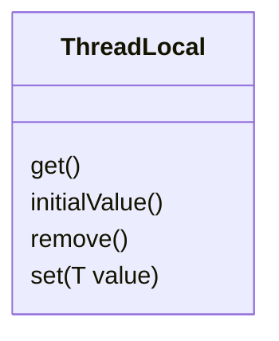

## Intent

Provide an ability to have a copy of a variable for each thread, making it thread-safe.

## Explanation

During code assembling compiler add _.tdata_ directive, 
which means that variables below will store in different places from thread to thread.
This means changing variable in one thread won't affect the same variable in other thread.

**Real world example**

> On constructions each worker has its own shovel. When one of them broke his shovel,
> other still can continue work due to they have own instrument.

**In plain words**

>Each thread will have its own copy of variable.

**Wikipedia says**

>Thread-local storage (TLS) is a computer programming method that uses static or global memory local to a thread.

**Programmatic Example**

To define variable in thread-local storage you just need to put it into Java's ThreadLocal, e.g:

```java
public class Main {
    
    private ThreadLocal<String> stringThreadLocal = new ThreadLocal<>();
    
    public void initialize(String value) {
        this.stringThreadLocal.set(value);
    }
}
```

Below we will contact a variable from two threads at a time to see, why we need it.  
Main logic that show's current variable value is imposed in class AbstractThreadLocalExample, two implementations 
differs only in the **value store approach**.

Main class:

```java
/**
 * Class with main per-thread logic.
 */
public abstract class AbstractThreadLocalExample implements Runnable {

    private static final Random RND = new Random();

    @Override
    public void run() {
        //Here we stop thread randomly
        LockSupport.parkNanos(RND.nextInt(1_000_000_000, 2_000_000_000));

        System.out.println(getCurrentThreadName() + ", before value changing: " + getter().get());
        setter().accept(RND.nextInt());
    }

    /**
     * Setter for our value.
     *
     * @return consumer
     */
    protected abstract Consumer<Integer> setter();

    /**
     * Getter for our value.
     *
     * @return supplier
     */
    protected abstract Supplier<Integer> getter();

    private String getCurrentThreadName() {
        return Thread.currentThread().getName();
    }
}

```

And two implementations. With ThreadLocal:
```java
/**
 * Example of runnable with use of {@link ThreadLocal}.
 */
public class WithThreadLocal extends AbstractThreadLocalExample {
    
    private ThreadLocal<Integer> value;

    public WithThreadLocal(ThreadLocal<Integer> value) {
        this.value = value;
    }

    @Override
    protected Consumer<Integer> setter() {
        return value::set;
    }

    @Override
    protected Supplier<Integer> getter() {
        return value::get;
    }
}
```

And the class that stores value in one shared for all threads place:
```java
/**
 * Example of runnable without usage of {@link ThreadLocal}.
 */
public class WithoutThreadLocal extends AbstractThreadLocalExample {

    private Integer value;

    public WithoutThreadLocal(Integer value) {
        this.value = value;
    }

    @Override
    protected Consumer<Integer> setter() {
        return integer -> value = integer;
    }

    @Override
    protected Supplier<Integer> getter() {
        return () -> value;
    }
}
```

Guess we want to run these classes. We will construct both implementations and invoke _run_ method.
So, we want to see initial value in console (thanks to System.out.println()). Let's take a look at tests.

```java
public class ThreadLocalTest {

    private final ByteArrayOutputStream outContent = new ByteArrayOutputStream();
    private final PrintStream originalOut = System.out;

    @BeforeEach
    public void setUpStreams() {
        System.setOut(new PrintStream(outContent));
    }

    @AfterEach
    public void restoreStreams() {
        System.setOut(originalOut);
    }

    @Test
    public void withoutThreadLocal() throws InterruptedException {
        int initialValue = 1234567890;

        int threadSize = 2;
        ExecutorService executor = Executors.newFixedThreadPool(threadSize);

        WithoutThreadLocal threadLocal = new WithoutThreadLocal(initialValue);
        for (int i = 0; i < threadSize; i++) {
            executor.submit(threadLocal);
        }
        executor.awaitTermination(3, TimeUnit.SECONDS);

        List<String> lines = outContent.toString().lines().toList();
        //Matches only first finished thread output, the second has changed by first thread value
        Assertions.assertFalse(lines.stream()
                .allMatch(line -> line.endsWith(String.valueOf(initialValue))));
    }

    @Test
    public void withThreadLocal() throws InterruptedException {
        int initialValue = 1234567890;

        int threadSize = 2;
        ExecutorService executor = Executors.newFixedThreadPool(threadSize);

        WithThreadLocal threadLocal = new WithThreadLocal(ThreadLocal.withInitial(() -> initialValue));
        for (int i = 0; i < threadSize; i++) {
            executor.submit(threadLocal);
        }

        executor.awaitTermination(3, TimeUnit.SECONDS);

        List<String> lines = outContent.toString().lines().toList();
        Assertions.assertTrue(lines.stream()
                .allMatch(line -> line.endsWith(String.valueOf(initialValue))));
    }
}
```

The output of test named withThreadLocal:
```
pool-2-thread-2, before value changing: 1234567890
pool-2-thread-1, before value changing: 1234567890

```

And the output of withoutThreadLocal:
```
pool-1-thread-2, before value changing: 1234567890
pool-1-thread-1, before value changing: 848843054
```
Where 1234567890 - is our initial value. We see, that in test _withoutThreadLocal_ 
thread 2 got out from LockSupport#parkNanos earlier than the first and 
change value in shared variable.

## Class diagram



## Applicability

Use ThreadLocal when:

- You need to run singleton with state in multiple threads
- You need to use not thread-safe classes in concurrency program

## Tutorials
- [Baeldung](https://www.baeldung.com/java-threadlocal)

## Known uses
- In java.lang.Thread during thread initialization
- In java.net.URL to prevent recursive provider lookups
- In org.junit.runners.BlockJUnit4ClassRunner to contain current rule
- In org.springframework:spring-web to store request context
- In org.apache.util.net.Nio2Endpoint to allow detecting if a completion handler completes inline
- In io.micrometer to avoid problems with not thread-safe NumberFormat

## Credits
- [Usage cases](https://chao-tic.github.io/blog/2018/12/25/tls)
- [Implementation in Linux](https://uclibc.org/docs/tls.pdf)