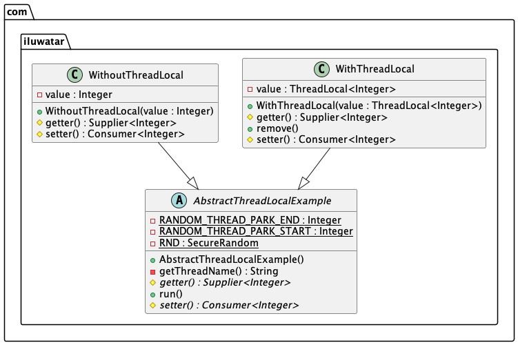

## Also known as

* TLS
* Thread-Specific Storage

## Intent

To provide each thread with its own isolated instance of a variable, avoiding shared access and synchronization issues.

## Explanation

Real-world example

> Imagine a busy restaurant where each waiter has their own personal notepad to take orders from customers. Each waiter's notepad is separate and used only by that specific waiter. This setup ensures that no waiter interferes with another's orders, avoiding confusion and mistakes. In this analogy, the restaurant represents the application, the waiters represent the threads, and the notepads represent thread-local storage, where each thread maintains its own isolated data.

In plain words

> Thread Local Storage provides each thread with its own isolated instance of a variable, eliminating the need for synchronization and avoiding shared access issues.

Wikipedia says

> In computer programming, thread-local storage (TLS) is a memory management method that uses static or global memory local to a thread. The concept allows storage of data that appears to be global in a system with separate threads.

**Programmatic Example**

Consider a scenario where threads need to maintain their own state without interfering with each other. We'll demonstrate this with two implementations:

1. With ThreadLocal: Each thread has its own isolated instance of a variable.
2. Without ThreadLocal: Threads share a single instance of a variable, leading to potential conflicts.

We start walking through the code from the base class.

**AbstractThreadLocalExample**

* Implements `Runnable` and includes `run` method which pauses the thread, prints the current value, and then changes it.
* `getter` and `setter` methods are abstract and will be implemented by subclasses.


```java
public abstract class AbstractThreadLocalExample implements Runnable {

    private static final Random RND = new Random();

    @Override
    public void run() {
        try {
            // Pause thread for a random duration
            Thread.sleep(RND.nextInt(1000));
            // Print the current value before changing it
            System.out.println(getCurrentThreadName() + ", before value changing: " + getter().get());
            // Change the value
            setter().accept(RND.nextInt(1000));
        } catch (InterruptedException e) {
            Thread.currentThread().interrupt();
        }
    }

    protected abstract Consumer<Integer> setter();
    protected abstract Supplier<Integer> getter();

    private String getCurrentThreadName() {
        return Thread.currentThread().getName();
    }
}
```

**WithThreadLocal**

* Uses `ThreadLocal` to ensure each thread has its own instance of `value`.


```java
public class WithThreadLocal extends AbstractThreadLocalExample {

    private ThreadLocal<Integer> value = ThreadLocal.withInitial(() -> 0);

    @Override
    protected Consumer<Integer> setter() {
        return value::set;
    }

    @Override
    protected Supplier<Integer> getter() {
        return value::get;
    }
}
```

**WithoutThreadLocal**

* Uses a shared `value` among all threads, demonstrating potential interference between threads.


```java
public class WithoutThreadLocal extends AbstractThreadLocalExample {

    private Integer value = 0;

    @Override
    protected Consumer<Integer> setter() {
        return integer -> value = integer;
    }

    @Override
    protected Supplier<Integer> getter() {
        return () -> value;
    }
}
```

**ThreadLocalTest**

* Tests both implementations by creating two threads for each and verifying their behavior.

```java
public class ThreadLocalTest {

    @Test
    public void withoutThreadLocal() throws InterruptedException {
        ExecutorService executor = Executors.newFixedThreadPool(2);
        for (int i = 0; i < 2; i++) {
            executor.submit(new WithoutThreadLocal());
        }
        executor.shutdown();
        executor.awaitTermination(1, TimeUnit.SECONDS);
    }

    @Test
    public void withThreadLocal() throws InterruptedException {
        ExecutorService executor = Executors.newFixedThreadPool(2);
        for (int i = 0; i < 2; i++) {
            executor.submit(new WithThreadLocal());
        }
        executor.shutdown();
        executor.awaitTermination(1, TimeUnit.SECONDS);
    }
}
```

The output of test named withThreadLocal:

```
pool-2-thread-2, before value changing: 1234567890
pool-2-thread-1, before value changing: 1234567890
```

And the output of withoutThreadLocal:

```
pool-1-thread-2, before value changing: 1234567890
pool-1-thread-1, before value changing: 848843054
```

Where 1234567890 is our initial value. We see that in test withoutThreadLocal thread 2 got out from LockSupport#parkNanos earlier than the first and change value in shared variable.

This example demonstrates how `ThreadLocal` variables provide isolated storage for each thread, preventing interference from other threads, whereas shared variables can lead to unexpected changes and thread interference.

## Class diagram



## Applicability

* Use when you need to avoid synchronization for performance reasons by providing each thread with its own instance of a variable.
* Useful in scenarios where threads need to maintain state information independently of other threads.
* Suitable for managing per-thread lifecycle states in web servers or handling thread-local configuration in multithreaded applications.

## Tutorials

* [An Introduction to ThreadLocal in Java - Baeldung](https://www.baeldung.com/java-threadlocal)

## Known uses

* Java ThreadLocal class, commonly used to manage user sessions in web applications.
* Database connections, where each thread gets its own connection instance.
* Locale settings in internationalized applications to ensure thread-specific locale information.
* In java.lang.Thread during thread initialization
* In java.net.URL to prevent recursive provider lookups
* In org.junit.runners.BlockJUnit4ClassRunner to contain current rule
* In org.springframework:spring-web to store request context
* In org.apache.util.net.Nio2Endpoint to allow detecting if a completion handler completes inline
* In io.micrometer to avoid problems with not thread-safe NumberFormat

## Consequences

Benefits:

* Eliminates the need for synchronization, which can improve performance in multithreaded environments.
* Simplifies design by avoiding complex synchronization mechanisms.
* Each thread has its own dedicated storage, reducing contention.

Trade-offs:

* Increased memory usage due to multiple instances of the variable.
* Potential for memory leaks if thread-local variables are not properly managed, especially in long-running applications or thread pools.
* Debugging can be more complex due to thread-specific storage behavior.

## Related Patterns

* [Singleton](https://java-design-patterns.com/patterns/singleton/): Both patterns ensure a unique instance of a variable, but Thread Local Storage ensures one per thread rather than one per application.
* [Flyweight](https://java-design-patterns.com/patterns/flyweight/): While Flyweight shares instances to minimize memory usage, Thread Local Storage creates separate instances for each thread.

## Credits

* [Design Patterns: Elements of Reusable Object-Oriented Software](https://amzn.to/3w0pvKI)
* [Effective Java](https://amzn.to/4cGk2Jz)
* [Java Concurrency in Practice](https://amzn.to/4aRMruW)
* [A Deep dive into (implicit) Thread Local Storage - Chao-tic](https://chao-tic.github.io/blog/2018/12/25/tls)
* [ELF Handling for Thread-Local Storage - Red Hat Inc.](https://uclibc.org/docs/tls.pdf)
