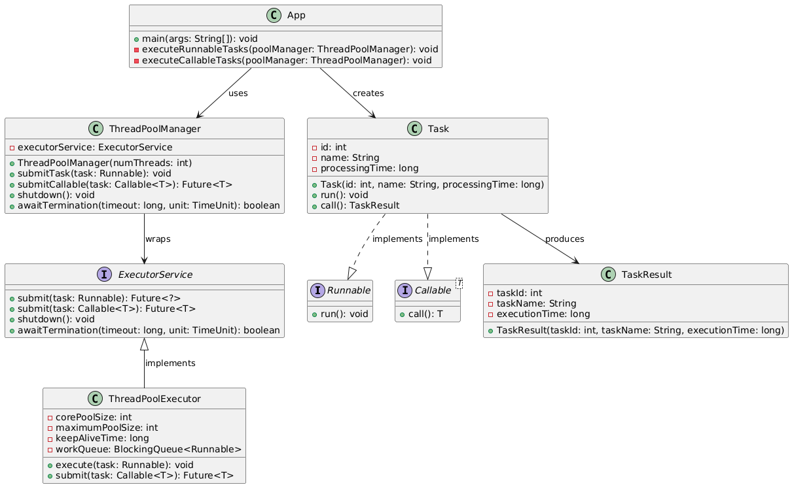

## Intent of Thread-Pool Executor Design Pattern

The Thread-Pool Executor pattern maintains a pool of worker threads to execute tasks concurrently,
optimizing resource usage by reusing existing threads instead of creating new ones for each task.

## Detailed Explanation of Thread-Pool Executor Pattern with Real-World Examples

### Real-world example

> Imagine a busy airport security checkpoint where instead of opening a new lane for each traveler,
> a fixed number of security lanes (threads) are open to process all passengers. Each security
> officer (thread) processes one passenger (task) at a time, and when finished, immediately calls the
> next passenger in line. During peak travel times, passengers wait in a queue, but the system is much
> more efficient than trying to open a new security lane for each individual traveler. The airport can
> handle fluctuating passenger traffic throughout the day with consistent staffing, optimizing both
> resource utilization and passenger throughput.

### In plain words

> Thread-Pool Executor keeps a set of reusable threads that process multiple tasks throughout their
> lifecycle, rather than creating a new thread for each task.

### Wikipedia says

> A thread pool is a software design pattern for achieving concurrency of execution in a computer
> program. Often also called a replicated workers or worker-crew model, a thread pool maintains
> multiple threads waiting for tasks to be allocated for concurrent execution by the supervising
> program.

### Class diagram



## Programmatic Example of Thread-Pool Executor Pattern in Java

Imagine a hotel front desk.

The number of employees (thread pool) is limited, but guests (tasks) keep arriving endlessly.

The Thread-Pool Executor pattern efficiently handles a large number of requests by reusing a small
set of threads.

```java
@Slf4j
public class HotelFrontDesk {
    public static void main(String[] args) throws InterruptedException, ExecutionException {
        // Hire 3 front desk employees (threads)
        ExecutorService frontDesk = Executors.newFixedThreadPool(3);

        LOGGER.info("Hotel front desk operation started!");

        // 7 regular guests checking in (Runnable)
        for (int i = 1; i <= 7; i++) {
            String guestName = "Guest-" + i;
            frontDesk.submit(() -> {
                String employeeName = Thread.currentThread().getName();
                LOGGER.info("{} is checking in {}...", employeeName, guestName);
                try {
                    Thread.sleep(2000); // Simulate check-in time
                } catch (InterruptedException e) {
                    Thread.currentThread().interrupt();
                }
                LOGGER.info("{} has been successfully checked in!", guestName);
            });
        }

        // 3 VIP guests checking in (Callable with result)
        Callable<String> vipGuest1 = createVipGuest("VIP-Guest-1");
        Callable<String> vipGuest2 = createVipGuest("VIP-Guest-2");
        Callable<String> vipGuest3 = createVipGuest("VIP-Guest-3");

        Future<String> vipResult1 = frontDesk.submit(vipGuest1);
        Future<String> vipResult2 = frontDesk.submit(vipGuest2);
        Future<String> vipResult3 = frontDesk.submit(vipGuest3);

        // Shutdown after submitting all tasks
        frontDesk.shutdown();

        if (frontDesk.awaitTermination(1, TimeUnit.HOURS)) {
            // Print VIP guests' check-in results
            LOGGER.info("VIP Check-in Results:");
            LOGGER.info(vipResult1.get());
            LOGGER.info(vipResult2.get());
            LOGGER.info(vipResult3.get());
            LOGGER.info("All guests have been successfully checked in. Front desk is now closed.");
        } else {
            LOGGER.info("Check-in timeout. Forcefully shutting down the front desk.");
        }
    }

    private static Callable<String> createVipGuest(String vipGuestName) {
        return () -> {
            String employeeName = Thread.currentThread().getName();
            LOGGER.info("{} is checking in VIP guest {}...", employeeName, vipGuestName);
            Thread.sleep(1000); // VIPs are faster to check in
            return vipGuestName + " has been successfully checked in!";
        };
    }
}
```

Here's the console output:

```markdown
Hotel front desk operation started!
pool-1-thread-3 is checking in Guest-3...
pool-1-thread-2 is checking in Guest-2...
pool-1-thread-1 is checking in Guest-1...
Guest-2 has been successfully checked in!
Guest-1 has been successfully checked in!
Guest-3 has been successfully checked in!
pool-1-thread-2 is checking in Guest-5...
pool-1-thread-3 is checking in Guest-4...
pool-1-thread-1 is checking in Guest-6...
Guest-5 has been successfully checked in!
pool-1-thread-2 is checking in Guest-7...
Guest-4 has been successfully checked in!
pool-1-thread-3 is checking in VIP guest VIP-Guest-1...
Guest-6 has been successfully checked in!
pool-1-thread-1 is checking in VIP guest VIP-Guest-2...
pool-1-thread-3 is checking in VIP guest VIP-Guest-3...
Guest-7 has been successfully checked in!
VIP Check-in Results:
VIP-Guest-1 has been successfully checked in!
VIP-Guest-2 has been successfully checked in!
VIP-Guest-3 has been successfully checked in!
All guests have been successfully checked in. Front desk is now closed.
```

**Note:** Since this example demonstrates asynchronous thread execution, **the actual output may vary between runs**. The order of execution and timing can differ due to thread scheduling, system load, and other factors that affect concurrent processing. The core behavior of the thread pool (limiting concurrent tasks to the number of threads and reusing threads) will remain consistent, but the exact sequence of log messages may change with each execution.

## When to Use the Thread-Pool Executor Pattern in Java

* When you need to limit the number of threads running simultaneously to avoid resource exhaustion
* For applications that process a large number of short-lived independent tasks
* To improve performance by reducing thread creation/destruction overhead
* When implementing server applications that handle multiple client requests concurrently
* To execute recurring tasks at fixed rates or with fixed delays

## Thread-Pool Executor Pattern Java Tutorial

* [Thread-Pool Executor Pattern Tutorial (Baeldung)](https://www.baeldung.com/thread-pool-java-and-guava)

## Real-World Applications of Thread-Pool Executor Pattern in Java

* Application servers like Tomcat and Jetty use thread pools to handle HTTP requests
* Database connection pools in JDBC implementations
* Background job processing frameworks like Spring Batch
* Task scheduling systems like Quartz Scheduler
* Java EE's Managed Executor Service for enterprise applications

## Benefits and Trade-offs of Thread-Pool Executor Pattern

### Benefits

* Improves performance by reusing existing threads instead of creating new ones
* Provides better resource management by limiting the number of active threads
* Simplifies thread lifecycle management and cleanup
* Facilitates easy implementation of task prioritization and scheduling
* Enhances application stability by preventing resource exhaustion

### Trade-offs

* May lead to thread starvation if improperly configured (too few threads)
* Potential for resource underutilization if improperly sized (too many threads)
* Requires careful shutdown handling to prevent task loss or resource leaks

## Related Java Design Patterns

* [Master-Worker Pattern](https://java-design-patterns.com/patterns/master-worker/): Tasks between a
  master and multiple workers.
* [Producer-Consumer Pattern](https://java-design-patterns.com/patterns/producer-consumer/):
  Separates task production and task consumption, typically using a blocking queue.
* [Object Pool Pattern](https://java-design-patterns.com/patterns/object-pool/): Reuses a set of
  objects (e.g., threads) instead of creating/destroying them repeatedly.

## References and Credits

* [Java Documentation for ThreadPoolExecutor](https://docs.oracle.com/en/java/javase/11/docs/api/java.base/java/util/concurrent/ThreadPoolExecutor.html)
* [Java Concurrency in Practice](https://jcip.net/) by Brian Goetz
* [Effective Java](https://www.oreilly.com/library/view/effective-java-3rd/9780134686097/) by Joshua
  Bloch
