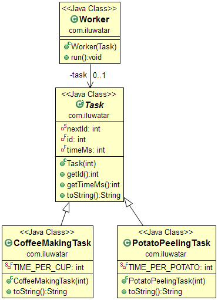

## Intent
It is often the case that tasks to be executed are short-lived and
the number of tasks is large. Creating a new thread for each task would make
the system spend more time creating and destroying the threads than executing
the actual tasks. Thread Pool solves this problem by reusing existing threads
and eliminating the latency of creating new threads.

## Class diagram

## Applicability
Use the Thread Pool pattern when

* You have a large number of short-lived tasks to be executed in parallel
