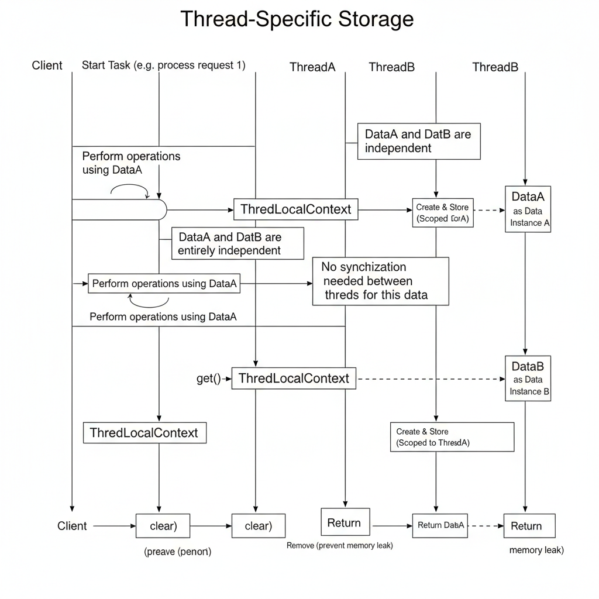

## Also known as

* Per-Thread Context
* Thread-Local Storage

## Intent of Thread-Specific Storage Design Pattern

The Thread-Specific Storage (TSS) pattern provides each thread with its own instance of a variable, ensuring thread safety without explicit synchronization.

By leveraging this approach, you can prevent race conditions and avoid the performance overhead associated with locks.

## Detailed Explanation of Tolerant Reader Pattern with Real-World Examples

Real-world example

> Imagine a hotel system where each guest keeps their own luggage count. Guests (threads) operate independently — adding or removing their luggage — without interfering with others.

Similarly, in multi-threaded software, each thread maintains its own copy of data using Thread-Specific Storage, ensuring isolation and preventing data corruption.

In plain words

> Each thread has its own data instance, avoiding the need for synchronization or shared state management.


Sequence diagram



## Programmatic Example of Thread-Specific Storage Pattern in Java

Let’s simulate a hotel management system where each guest (thread) has their own luggage count stored in a ThreadLocal variable.

```java
package com.iluwatar.threadspecificstorage;

import java.util.concurrent.ThreadLocalRandom;

public class ThreadLocalContext {
  private static final ThreadLocal<Integer> luggageCount = ThreadLocal.withInitial(() -> 0);

  public static void setLuggageCount(int count) {
    luggageCount.set(count);
  }

  public static int getLuggageCount() {
    return luggageCount.get();
  }

  public static void clear() {
    // Crucial for preventing memory leaks in thread pools!
    luggageCount.remove(); 
  }
}
```

Example usage

```java
public class App implements Runnable {

  @Override
  public void run() {
    try {
      // 1. Set the initial luggage count for this thread/guest
      int initialCount = ThreadLocalRandom.current().nextInt(1, 5);
      ThreadLocalContext.setLuggageCount(initialCount);
      System.out.printf("%s: Initial luggage count set to %d%n", 
          Thread.currentThread().getName(), ThreadLocalContext.getLuggageCount());

      // 2. Simulate some independent work
      Thread.sleep(100);

      // 3. Update the count - this only affects this thread's copy
      ThreadLocalContext.setLuggageCount(ThreadLocalContext.getLuggageCount() + 1);
      System.out.printf("%s: New luggage count is %d%n", 
          Thread.currentThread().getName(), ThreadLocalContext.getLuggageCount());

    } catch (InterruptedException e) {
      Thread.currentThread().interrupt();
    } finally {
      // 4. Cleanup is vital, especially with thread pools
      ThreadLocalContext.clear();
      System.out.printf("%s: Cleared luggage context.%n", Thread.currentThread().getName());
    }
  }

  public static void main(String[] args) {
    // Two threads operate on their own isolated 'luggageCount'
    new Thread(new App(), "Guest-Alice").start();
    new Thread(new App(), "Guest-Bob").start();
  }
}
```


Program output (Order may vary due to concurrency):

```
Guest-Alice: Initial luggage count set to 3
Guest-Bob: Initial luggage count set to 1
Guest-Alice: New luggage count is 4
Guest-Bob: New luggage count is 2
Guest-Bob: Cleared luggage context.
Guest-Alice: Cleared luggage context.
```

## When to Use the Tolerant Reader Pattern in Java

* Context Management: When you need to maintain a per-request or per-thread context (e.g., user session, transaction ID, security credentials) that must be accessible by multiple classes within the same thread, without passing it explicitly as a method argument.
* Thread-Local Accumulation: When performing an accumulation or calculation in parallel where each thread needs a temporary, isolated variable (e.g., a counter or buffer) before a final, synchronized merge.
* Stateless Services with Stateful Data: In frameworks like Spring, to make a conceptually "stateful" resource (like a database connection) thread-safe by having each thread get its own copy from a pool.

## Real-World Applications of Tolerant Reader Pattern in Java

* Java's ThreadLocal class is the direct implementation.
* Database Transaction Management in frameworks like Spring, where the current transaction object is stored in a ThreadLocal.
* Log Correlation IDs where a unique ID for a request is stored at the beginning of thread execution and retrieved by logging components throughout the request processing chain.

## Benefits and Trade-offs of Tolerant Reader Pattern

Benefits:

* Superior Performance: Eliminates the overhead of explicit locking and synchronization primitives.
* Simplified Thread Safety: Naturally prevents race conditions by isolating state.
* Cleaner API: Avoids cluttering method signatures by not requiring context parameters to be passed through multiple layers.

Trade-offs:

* Potential Memory Leaks: If used with thread pools, failing to call ThreadLocal.remove() can cause the thread's local data to persist and leak memory.
* Increased Code Obscurity: Hides the state management, making it less obvious that a variable is thread-specific and not a shared global one.

## Related Java Design Patterns

* [Monitor Object:](https://en.wikipedia.org/wiki/Monitor_(synchronization)): Ensures only one thread can execute a critical section of code within an object at a time, which is the synchronization approach that TSS avoids.
* [Active Object:](https://en.wikipedia.org/wiki/Active_object): Decouples method invocation from execution, often running methods in their own thread; TSS can manage context within that dedicated thread.
* [Thread Pool:](https://en.wikipedia.org/wiki/Thread_pool): Manages a group of reusable worker threads; proper use of TSS requires cleanup (remove()) to prevent state leakage between tasks.

## References and Credits

* [Seminal pattern catalog that documents TSS as a concurrency pattern.](https://www.dre.vanderbilt.edu/~schmidt/POSA/POSA2/conc-patterns.html)
* [Doug Lea's definitive work covering the principles and patterns, including Java's ThreadLocal implementation.](https://www.oreilly.com/library/view/concurrent-programming-in/0201310090/)
* [Comprehensive paper defining the original TSS pattern and its benefits in eliminating locking overhead.](https://www.dre.vanderbilt.edu/~schmidt/PDF/TSS-pattern.pdf)

