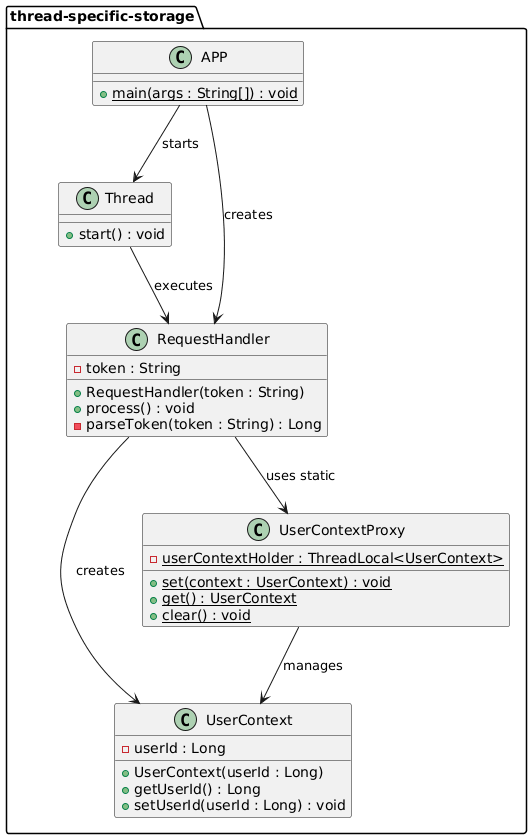

## Intent of Thread-Specific Storage Design Pattern

The Thread-Specific Storage pattern ensures that each thread has its own isolated instance of shared data,
preventing concurrency issues by eliminating the need for synchronization. It achieves this by using
ThreadLocal variables to store data that is specific to each thread.

## Detailed Explanation of Thread-Specific Storage Pattern with Real-World Examples

### Real-world example

> Think of a customer service center where each agent has their own notepad to record information
> about the customer they're currently helping. Even if multiple agents are helping customers
> simultaneously, each agent's notes are completely separate from the others'. When an agent finishes
> with one customer and moves to the next, they start with a fresh notepad. This approach eliminates
> the need for agents to coordinate their note-taking, as each agent's notes are private to their
> current customer interaction.

### In plain words

> Thread-Specific Storage provides each thread with its own private copy of data, isolating thread
> interactions and avoiding the need for synchronization mechanisms.

### Wikipedia says

> Thread-local storage (TLS) is a computer programming method that uses static or global memory
> local to a thread. TLS is a common technique for avoiding race conditions when multiple threads
> need to access the same data. Each thread has its own copy of the data, so there is no need for
> synchronization.

### Class diagram



## Programmatic Example of Thread-Specific Storage Pattern in Java

Imagine a web application that needs to track the current user's context across different stages of request processing.

Each request is handled by a separate thread, and we need to maintain user-specific information without
synchronization overhead.

The Thread-Specific Storage pattern efficiently handles this by providing each thread with its own copy
of the user context data.

```java
@Slf4j
public class APP {
  public static void main(String[] args) {
    // Simulate concurrent requests from multiple users
    for (int i = 1; i <= 5; i++) {
      // Simulate tokens for different users
      String token = "token::" + (i % 3 + 1); // 3 distinct users

      new Thread(() -> {
        // Simulate request processing flow
        RequestHandler handler = new RequestHandler(token);
        handler.process();
      }).start();

      // Slightly stagger request times
      try {
        Thread.sleep(50);
      } catch (InterruptedException e) {
        e.printStackTrace();
      }
    }
  }
}
```

Here's how the request handler processes each request:

```java
@Slf4j
public class RequestHandler {
  private final String token;

  public RequestHandler(String token) {
    this.token = token;
  }

  public void process() {
    LOGGER.info("Start handling request with token: {}", token);

    try {
      // Step 1: Parse token to get userId
      Long userId = parseToken(token);

      // Step 2: Save userId in ThreadLocal storage
      UserContextProxy.set(new UserContext(userId));

      // Simulate delay between stages of request handling
      Thread.sleep(200);

      // Step 3: Retrieve userId later in the request flow
      Long retrievedId = UserContextProxy.get().getUserId();
      Random random = new Random();
      String accountInfo = retrievedId + "'s account: " + random.nextInt(400);
      LOGGER.info(accountInfo);

    } catch (InterruptedException e) {
      Thread.currentThread().interrupt();
    } finally {
      // Step 4: Clear ThreadLocal to avoid potential memory leaks
      UserContextProxy.clear();
    }
  }
  
  // ... parseToken method implementation
}
```

The UserContextProxy acts as a thread-safe accessor to the ThreadLocal storage:

```java
public class UserContextProxy {
  // Underlying TSObjectCollection (ThreadLocalMap) managed by JVM.
  // This ThreadLocal acts as the Key for the map.
  private static final ThreadLocal<UserContext> userContextHolder = new ThreadLocal<>();

  /**
   * Private constructor to prevent instantiation of this utility class.
   */
  private UserContextProxy() {}

  /** Set UserContext for the current thread */
  public static void set(UserContext context) {
    userContextHolder.set(context);
  }

  /** Get UserContext for the current thread */
  public static UserContext get() {
    return userContextHolder.get();
  }

  /** Clear UserContext to prevent potential memory leaks */
  public static void clear() {
    userContextHolder.remove();
  }
}
```

Here's a sample console output:

```
Start handling request with token: token::1
Start handling request with token: token::2
Start handling request with token: token::3
Start handling request with token: token::1
1's account: 234
Start handling request with token: token::2
2's account: 157
3's account: 89
1's account: 342
2's account: 76
```

**Note:** Since this example demonstrates concurrent thread execution, **the actual output may vary between runs**. The order of execution and timing can differ due to thread scheduling, system load, and other factors that affect concurrent processing. However, each thread will correctly maintain its own user context without interference from other threads.

## When to Use the Thread-Specific Storage Pattern in Java

* When you need to maintain per-thread state without synchronization overhead
* For applications that process requests in multiple stages and need to share data across those stages
* To avoid concurrency issues when working with non-thread-safe objects like SimpleDateFormat
* When implementing logging or security context that needs to be accessible throughout a request processing
* To maintain thread-specific caches or counters without risk of data corruption

## Thread-Specific Storage Pattern Java Tutorial

* [Thread-Specific Storage Pattern Tutorial (Baeldung)](https://www.baeldung.com/java-threadlocal)

## Real-World Applications of Thread-Specific Storage Pattern in Java

* Servlet containers use ThreadLocal to maintain the current request and response objects
* Spring Framework uses ThreadLocal for managing transaction contexts and security contexts
* Logging frameworks use ThreadLocal to associate log messages with the current thread's context
* Database connection management where each thread needs its own connection or maintains a connection pool per thread
* User session management in web applications where session data is accessed across multiple layers

## Benefits and Trade-offs of Thread-Specific Storage Pattern

### Benefits

* Eliminates the need for synchronization mechanisms, improving performance
* Provides complete isolation of data between threads, preventing concurrency issues
* Simplifies code by removing the need to pass context objects through method parameters
* Enables safe use of non-thread-safe classes in multi-threaded environments
* Reduces object creation overhead by reusing thread-local instances

### Trade-offs

* Can lead to increased memory consumption as each thread maintains its own copy of data
* Requires careful cleanup to prevent memory leaks, especially in long-running applications
* May complicate debugging as data is not visible across threads
* Can cause issues in environments with thread pooling where threads are reused (data from previous tasks may persist)

## Related Java Design Patterns

* [Context Object Pattern](https://java-design-patterns.com/patterns/context-object/): Encapsulates
  request-specific information into a context object that can be passed between components.
* [Thread Pool Pattern](https://java-design-patterns.com/patterns/thread-pool-executor/):
  Maintains a pool of worker threads to execute tasks concurrently, optimizing resource usage.
* [Singleton Pattern](https://java-design-patterns.com/patterns/singleton/): Ensures a class has only
  one instance and provides global access to it, similar to how ThreadLocal provides per-thread access.

## References and Credits

* [Pattern-Oriented Software Architecture, Volume 2: Patterns for Concurrent and Networked Objects](https://www.amazon.com/Pattern-Oriented-Software-Architecture-Concurrent-Networked/dp/0471606952)
* [Java Documentation for ThreadLocal](https://docs.oracle.com/en/java/javase/11/docs/api/java.base/java/lang/ThreadLocal.html)
* [Java Concurrency in Practice](https://jcip.net/) by Brian Goetz