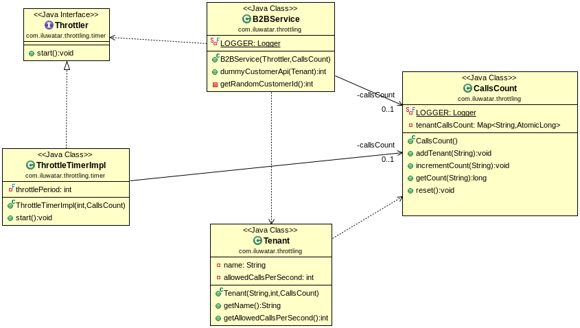

## Intent
Ensure that a given client is not able to access service resources more than the assigned limit.

## Class diagram

## Applicability
The Throttling pattern should be used:

* When a service access needs to be restricted to not have high impacts on the performance of the service.
* When multiple clients are consuming the same service resources and restriction has to be made according to the usage per client.
