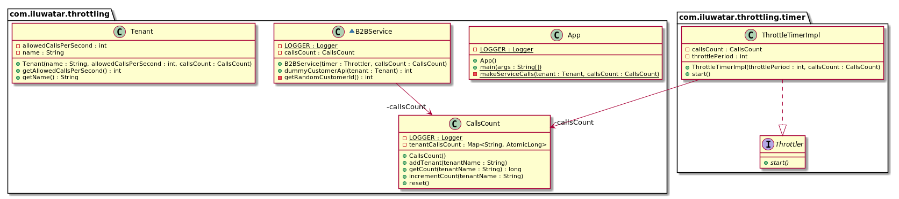

## Intent

Ensure that a given client is not able to access service resources more than the assigned limit.

## Explanation

Real world example

> A large multinational corporation offers API to its customers. The API is rate-limited and each 
> customer can only make certain amount of calls per second.      

In plain words

> Throttling pattern is used to rate-limit access to a resource. 

[Microsoft documentation](https://docs.microsoft.com/en-us/azure/architecture/patterns/throttling) says

> Control the consumption of resources used by an instance of an application, an individual tenant, 
> or an entire service. This can allow the system to continue to function and meet service level 
> agreements, even when an increase in demand places an extreme load on resources.

**Programmatic Example**

Tenant class presents the clients of the API. CallsCount tracks the number of API calls per tenant.

```java
public class Tenant {

  private final String name;
  private final int allowedCallsPerSecond;

  public Tenant(String name, int allowedCallsPerSecond, CallsCount callsCount) {
    if (allowedCallsPerSecond < 0) {
      throw new InvalidParameterException("Number of calls less than 0 not allowed");
    }
    this.name = name;
    this.allowedCallsPerSecond = allowedCallsPerSecond;
    callsCount.addTenant(name);
  }

  public String getName() {
    return name;
  }

  public int getAllowedCallsPerSecond() {
    return allowedCallsPerSecond;
  }
}

@Slf4j
public final class CallsCount {
  private final Map<String, AtomicLong> tenantCallsCount = new ConcurrentHashMap<>();

  public void addTenant(String tenantName) {
    tenantCallsCount.putIfAbsent(tenantName, new AtomicLong(0));
  }

  public void incrementCount(String tenantName) {
    tenantCallsCount.get(tenantName).incrementAndGet();
  }

  public long getCount(String tenantName) {
    return tenantCallsCount.get(tenantName).get();
  }

  public void reset() {
    LOGGER.debug("Resetting the map.");
    tenantCallsCount.replaceAll((k, v) -> new AtomicLong(0));
  }
}
```

Next we introduce the service that the tenants are calling. To track the call count we use the 
throttler timer.

```java
public interface Throttler {

  void start();
}

public class ThrottleTimerImpl implements Throttler {

  private final int throttlePeriod;
  private final CallsCount callsCount;

  public ThrottleTimerImpl(int throttlePeriod, CallsCount callsCount) {
    this.throttlePeriod = throttlePeriod;
    this.callsCount = callsCount;
  }

  @Override
  public void start() {
    new Timer(true).schedule(new TimerTask() {
      @Override
      public void run() {
        callsCount.reset();
      }
    }, 0, throttlePeriod);
  }
}

class B2BService {

  private static final Logger LOGGER = LoggerFactory.getLogger(B2BService.class);
  private final CallsCount callsCount;

  public B2BService(Throttler timer, CallsCount callsCount) {
    this.callsCount = callsCount;
    timer.start();
  }

  public int dummyCustomerApi(Tenant tenant) {
    var tenantName = tenant.getName();
    var count = callsCount.getCount(tenantName);
    LOGGER.debug("Counter for {} : {} ", tenant.getName(), count);
    if (count >= tenant.getAllowedCallsPerSecond()) {
      LOGGER.error("API access per second limit reached for: {}", tenantName);
      return -1;
    }
    callsCount.incrementCount(tenantName);
    return getRandomCustomerId();
  }

  private int getRandomCustomerId() {
    return ThreadLocalRandom.current().nextInt(1, 10000);
  }
}
```

Now we are ready to see the full example in action. Tenant Adidas is rate-limited to 5 calls per 
second and Nike to 6.

```java
  public static void main(String[] args) {
    var callsCount = new CallsCount();
    var adidas = new Tenant("Adidas", 5, callsCount);
    var nike = new Tenant("Nike", 6, callsCount);

    var executorService = Executors.newFixedThreadPool(2);
    executorService.execute(() -> makeServiceCalls(adidas, callsCount));
    executorService.execute(() -> makeServiceCalls(nike, callsCount));
    executorService.shutdown();
    
    try {
      executorService.awaitTermination(10, TimeUnit.SECONDS);
    } catch (InterruptedException e) {
      LOGGER.error("Executor Service terminated: {}", e.getMessage());
    }
  }

  private static void makeServiceCalls(Tenant tenant, CallsCount callsCount) {
    var timer = new ThrottleTimerImpl(10, callsCount);
    var service = new B2BService(timer, callsCount);
    // Sleep is introduced to keep the output in check and easy to view and analyze the results.
    IntStream.range(0, 20).forEach(i -> {
      service.dummyCustomerApi(tenant);
      try {
        Thread.sleep(1);
      } catch (InterruptedException e) {
        LOGGER.error("Thread interrupted: {}", e.getMessage());
      }
    });
  }
```


## Class diagram



## Applicability

The Throttling pattern should be used:

* When a service access needs to be restricted to not have high impacts on the performance of the service.
* When multiple clients are consuming the same service resources and restriction has to be made according to the usage per client.

## Credits

* [Throttling pattern](https://docs.microsoft.com/en-us/azure/architecture/patterns/throttling)
* [Cloud Design Patterns: Prescriptive Architecture Guidance for Cloud Applications (Microsoft patterns & practices)](https://www.amazon.com/gp/product/B00ITGHBBS/ref=as_li_qf_asin_il_tl?ie=UTF8&tag=javadesignpat-20&creative=9325&linkCode=as2&creativeASIN=B00ITGHBBS&linkId=12aacdd0cec04f372e7152689525631a)
