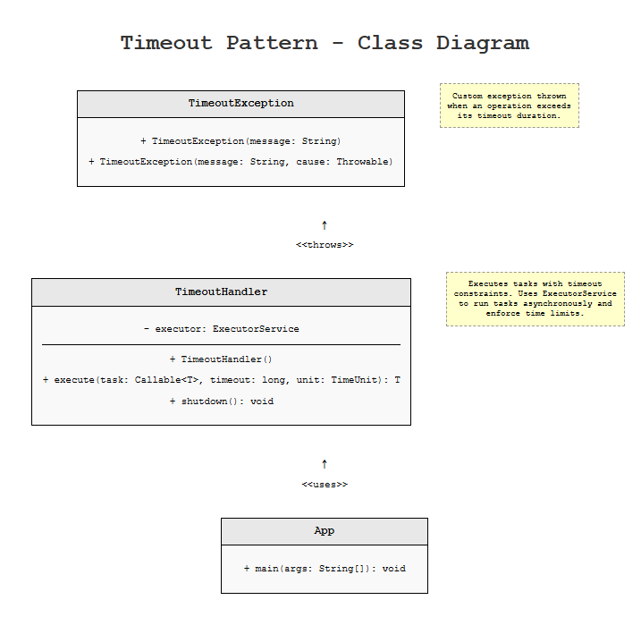

# Timeout Pattern

## Intent
Prevent operations from blocking indefinitely by setting a maximum time limit for their completion. If the operation doesn't complete within the specified timeout period, it is cancelled and control is returned to the caller with an error.

## Explanation

Real-world example

> Consider a restaurant where customers place orders. The kitchen has a policy that if a dish cannot be prepared within 30 minutes, the order is cancelled and the customer is notified. This prevents customers from waiting indefinitely and allows them to make alternative arrangements.

In plain words

> The Timeout pattern ensures that operations complete within a specified time limit, preventing indefinite blocking and improving system responsiveness.

**Programmatic Example**

The Timeout pattern is implemented using the `TimeoutHandler` class which wraps operations and enforces time constraints:

```java
TimeoutHandler handler = new TimeoutHandler();

// Execute a task with 3 second timeout
try {
    String result = handler.execute(() -> {
        // Simulate some processing
        Thread.sleep(1000);
        return "Operation completed";
    }, 3, TimeUnit.SECONDS);
    
    System.out.println(result);
} catch (TimeoutException e) {
    System.err.println("Operation timed out: " + e.getMessage());
}
```

The `TimeoutHandler` uses an `ExecutorService` to run tasks asynchronously and monitors their completion:

```java
public <T> T execute(Callable<T> task, long timeout, TimeUnit unit) 
    throws TimeoutException {
    Future<T> future = executor.submit(task);
    
    try {
        return future.get(timeout, unit);
    } catch (java.util.concurrent.TimeoutException e) {
        future.cancel(true);
        throw new TimeoutException("Operation timed out", e);
    }
}
```

## Class diagram



## Applicability

Use the Timeout pattern when:

- Operations might block indefinitely due to network issues, slow services, or resource contention
- You need to maintain system responsiveness even when dependencies are slow
- Cascading failures need to be prevented in distributed systems
- SLA requirements mandate maximum response times
- You want to implement circuit breaker or retry patterns

## Known Uses

- HTTP client libraries (setting connection and read timeouts)
- Database connection pools (query timeouts)
- Microservices communication (service-to-service call timeouts)
- Message queue consumers (message processing timeouts)
- RPC frameworks (remote procedure call timeouts)

## Consequences

Benefits:
- Prevents indefinite blocking and resource exhaustion
- Improves system responsiveness and user experience
- Enables better error handling and recovery strategies
- Helps maintain SLA commitments
- Prevents cascading failures in distributed systems

Trade-offs:
- Requires careful tuning of timeout values
- May need retry logic for transient failures
- Can increase system complexity
- Might cancel operations that would have eventually succeeded

## Related Patterns

- Circuit Breaker: Often used together; circuit breaker opens after multiple timeout failures
- Retry: Used to handle timeout exceptions by retrying the operation
- Bulkhead: Isolates resources to prevent timeout cascades
- Async Method Invocation: Provides non-blocking execution with timeout support

## Credits

- [Microsoft Azure - Timeout Pattern](https://docs.microsoft.com/en-us/azure/architecture/patterns/timeout)
- [Release It!: Design and Deploy Production-Ready Software](https://www.amazon.com/Release-Design-Deploy-Production-Ready-Software/dp/1680502395)
- [Building Microservices: Designing Fine-Grained Systems](https://www.amazon.com/Building-Microservices-Designing-Fine-Grained-Systems/dp/1491950358)