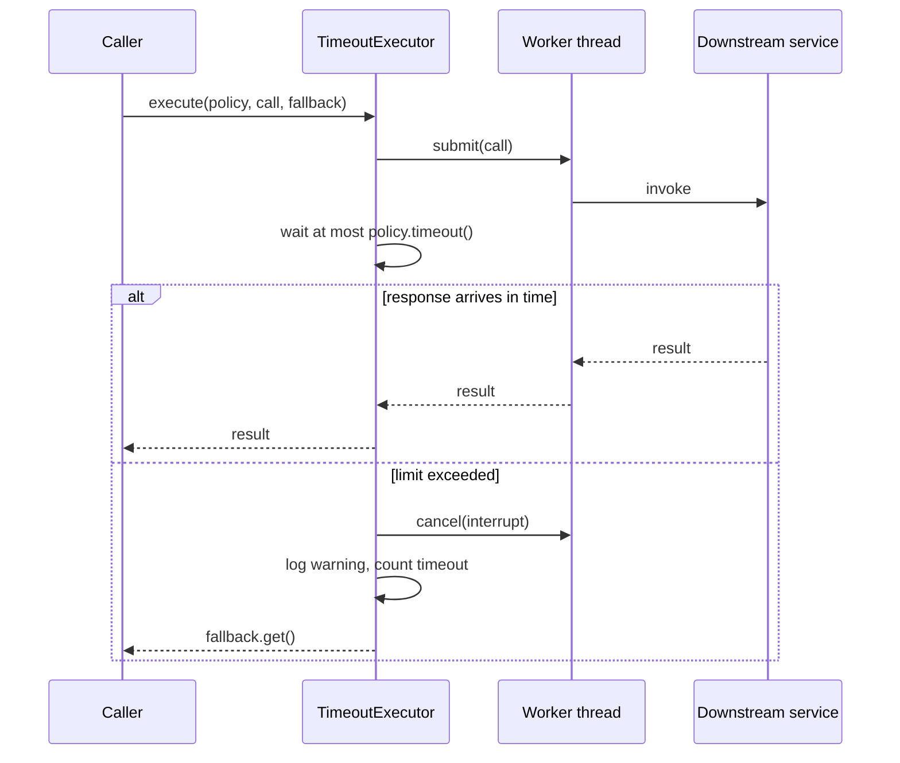
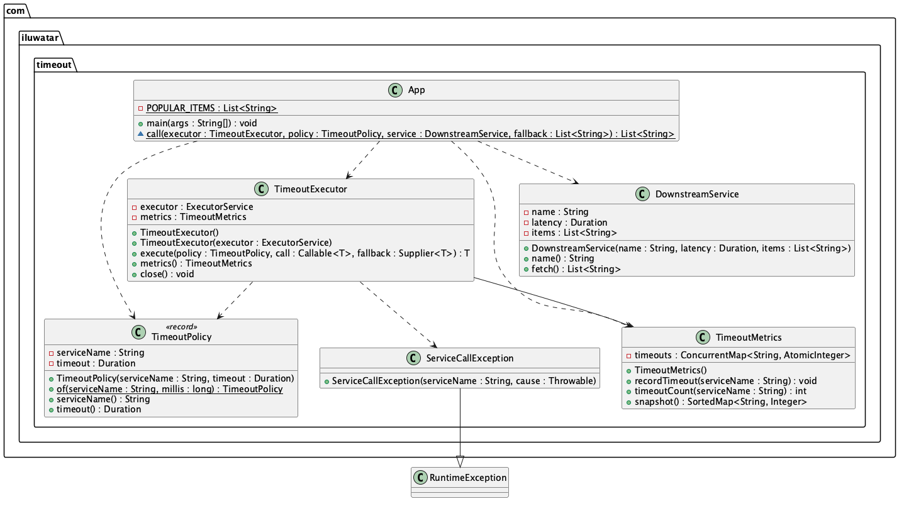

## Also known as

* Time Limiter
* Deadline

## Intent of Timeout Design Pattern

Bound how long a caller waits for a downstream service. When the limit is exceeded the call is abandoned, the event is recorded, and the caller continues with a fallback, so the latency of one slow dependency never becomes the latency of the whole system.

## Detailed Explanation of Timeout Pattern with Real-World Examples

Real-world example

> A pizza chain's online shop asks a separate recommendation engine which side dishes to suggest during checkout. One evening the recommendation engine starts taking twenty seconds per request. Without a limit, every checkout waits those twenty seconds, threads pile up, and soon nobody can order a pizza at all. With a 100 ms limit, the shop stops waiting, shows the always available "most popular sides" list instead, and the order goes through. The slow engine is logged and counted so the on-call engineer can look at it in the morning.

In plain words

> Decide up front how long you are willing to wait for a dependency, and when the time is up, stop waiting and move on with a plan B.

microservices.io says

> Prevent a client from waiting indefinitely for a response from a service by aborting the request after a specified time period.

Sequence diagram


```mermaid
sequenceDiagram
    participant Caller
    participant TimeoutExecutor
    participant Worker as Worker thread
    participant Service as Downstream service

    Caller->>TimeoutExecutor: execute(policy, call, fallback)
    TimeoutExecutor->>Worker: submit(call)
    Worker->>Service: invoke
    TimeoutExecutor->>TimeoutExecutor: wait at most policy.timeout()
    alt response arrives in time
        Service-->>Worker: result
        Worker-->>TimeoutExecutor: result
        TimeoutExecutor-->>Caller: result
    else limit exceeded
        TimeoutExecutor->>Worker: cancel(interrupt)
        TimeoutExecutor->>TimeoutExecutor: log warning, count timeout
        TimeoutExecutor-->>Caller: fallback.get()
    end
```



## Programmatic Example of Timeout Pattern in Java

The example models an online shop that calls two downstream services. The product catalog is fast; the recommendation engine is slow. Each gets its own time limit.

1. **Declare a limit per service**

   A `TimeoutPolicy` couples a service name with the maximum time the caller is willing to wait. The record validates that the limit is positive.

```java
public record TimeoutPolicy(String serviceName, Duration timeout) {

  public TimeoutPolicy {
    Objects.requireNonNull(serviceName, "serviceName");
    Objects.requireNonNull(timeout, "timeout");
    if (serviceName.isBlank()) {
      throw new IllegalArgumentException("serviceName must not be blank");
    }
    if (timeout.isZero() || timeout.isNegative()) {
      throw new IllegalArgumentException("timeout must be positive");
    }
  }

  public static TimeoutPolicy of(String serviceName, long millis) {
    return new TimeoutPolicy(serviceName, Duration.ofMillis(millis));
  }
}
```

2. **Enforce the limit**

   `TimeoutExecutor` runs the call on a worker thread and waits for at most the configured duration. On a timeout it cancels the worker with an interrupt, logs the event, counts it in `TimeoutMetrics`, and returns the fallback. A failure raised by the service, or a call the pool refuses to accept, is not a timeout and is rethrown as `ServiceCallException`.

```java
@Slf4j
public class TimeoutExecutor implements AutoCloseable {

  private final ExecutorService executor;
  private final TimeoutMetrics metrics = new TimeoutMetrics();

  public TimeoutExecutor() {
    this(Executors.newVirtualThreadPerTaskExecutor());
  }

  public <T> T execute(TimeoutPolicy policy, Callable<T> call, Supplier<T> fallback) {
    var serviceName = policy.serviceName();
    var limitMillis = policy.timeout().toMillis();
    Future<T> future = null;
    try {
      future = executor.submit(call);
      var result = future.get(limitMillis, TimeUnit.MILLISECONDS);
      LOGGER.info("{} responded within its {} ms limit", serviceName, limitMillis);
      return result;
    } catch (TimeoutException e) {
      future.cancel(true);
      metrics.recordTimeout(serviceName);
      LOGGER.warn(
          "{} exceeded its {} ms limit; call cancelled, using fallback", serviceName, limitMillis);
      return fallback.get();
    } catch (ExecutionException e) {
      throw new ServiceCallException(serviceName, e.getCause());
    } catch (InterruptedException e) {
      future.cancel(true);
      Thread.currentThread().interrupt();
      throw new ServiceCallException(serviceName, e);
    } catch (RejectedExecutionException e) {
      throw new ServiceCallException(serviceName, e);
    }
  }

  @Override
  public void close() {
    executor.shutdownNow();
  }
}
```

3. **Make the service cooperate with cancellation**

   The simulated `DownstreamService` sleeps interruptibly, so the interrupt sent by the executor actually stops the work instead of leaving it running in the background. Its name, latency and payload are constructor arguments, so the same class plays both the fast catalog and the slow recommendation engine.

```java
public List<String> fetch() throws InterruptedException {
  LOGGER.info("{}: responding, expected latency {} ms", name, latency.toMillis());
  try {
    Thread.sleep(latency);
  } catch (InterruptedException e) {
    LOGGER.info("{}: interrupted, abandoning the call", name);
    throw e;
  }
  return items;
}
```

4. **Wire it together**

   `App` gives the catalog a 500 ms limit and recommendations a 100 ms one, then runs both calls through a small helper that pairs the policy with the call and its fallback. The catalog answers in time; the recommendation engine needs 400 ms, so the customer sees popular items instead and the timeout counter shows one event.

```java
static List<String> call(
    TimeoutExecutor executor,
    TimeoutPolicy policy,
    DownstreamService service,
    List<String> fallback) {
  return executor.execute(policy, service::fetch, () -> fallback);
}
```

```java
var catalog =
    new DownstreamService(
        "product-catalog", Duration.ofMillis(50), List.of("Laptop", "Headphones", "Monitor"));
var recommendations =
    new DownstreamService(
        "recommendations", Duration.ofMillis(400), List.of("Mechanical keyboard", "USB-C dock"));
var catalogPolicy = TimeoutPolicy.of(catalog.name(), 500);
var recommendationPolicy = TimeoutPolicy.of(recommendations.name(), 100);

try (var executor = new TimeoutExecutor()) {
  var products = call(executor, catalogPolicy, catalog, List.of());
  LOGGER.info("Products: {}", products);

  var suggested = call(executor, recommendationPolicy, recommendations, POPULAR_ITEMS);
  LOGGER.info("Recommendations shown to alice: {}", suggested);

  LOGGER.info("Timeouts per service: {}", executor.metrics().snapshot());
}
```

Running the application produces output along these lines:

```
Configured per-service limits: catalog 500 ms, recommendations 100 ms
Calling product-catalog
product-catalog: responding, expected latency 50 ms
product-catalog responded within its 500 ms limit
Products: [Laptop, Headphones, Monitor]
Calling recommendations
recommendations: responding, expected latency 400 ms
recommendations: interrupted, abandoning the call
recommendations exceeded its 100 ms limit; call cancelled, using fallback
Recommendations shown to alice: [Wireless mouse, Webcam]
Timeouts per service: {recommendations=1}
```

The "exceeded its 100 ms limit" line is written by the caller and the "interrupted, abandoning" line by the worker thread, so the two may appear in either order from run to run.

## When to Use the Timeout Pattern in Java

* Whenever a call leaves the process: HTTP and gRPC calls, database queries, message broker round trips, third-party APIs.
* When a degraded answer delivered on time is worth more than a perfect answer delivered late.
* When threads, connections or other pooled resources are held for the duration of a call and must not be tied up by a stalled dependency.
* When different dependencies have different latency profiles and need individually tuned limits.

## Real-World Applications of Timeout Pattern in Java

* [Resilience4j TimeLimiter](https://resilience4j.readme.io/docs/timelimiter) wraps a `CompletableFuture` or `Future` with a configurable limit and optional cancellation.
* [Netflix Hystrix](https://github.com/Netflix/Hystrix/wiki/Configuration#execution.isolation.thread.timeoutInMilliseconds) applied a per-command execution timeout before falling back.
* [gRPC deadlines](https://grpc.io/docs/guides/deadlines/) propagate a limit across service hops.
* `java.net.http.HttpClient` connect and request timeouts, JDBC `queryTimeout`, and `Future.get(long, TimeUnit)` in the JDK.

## Benefits and Trade-offs of Timeout Pattern

Benefits:

* **Predictable latency**: The caller's worst case is the configured limit plus the fallback cost, not the dependency's worst case.
* **Failure containment**: Stalled dependencies stop consuming threads and connections, which prevents cascading failures.
* **Observability**: Every timeout is logged and counted, exposing dependencies that regularly miss their budget.
* **Independent tuning**: Each service gets a limit that matches its normal latency.

Trade-offs:

* **Choosing the value is hard**: Too short causes false alarms under normal jitter; too long defeats the purpose.
* **Wasted work**: A cancelled call may already have done its side effects, so operations that are not idempotent need care.
* **Cooperative cancellation**: An interrupt only stops code that checks for it; blocking calls that ignore interrupts keep running until they finish on their own.
* **Fallback quality**: The fallback must be genuinely cheap and safe, otherwise the pattern only moves the problem.

## Related Java Design Patterns

* [Fallback](../fallback): Supplies the alternative answer once a timeout fires. The fallback module treats the time limit as one of several triggers; this module makes the limit itself the subject, with per-service configuration, cancellation and metrics.
* [Circuit Breaker](../circuit-breaker): Counts timeouts as failures and stops calling a dependency that keeps overrunning its limit.
* [Retry](../retry): Retries a call that timed out, ideally with a total deadline so retries cannot multiply the wait.
* Bulkhead: Limits how many concurrent calls a dependency may hold, complementing the limit on how long each call may take.

## References and Credits

* [Timeout pattern (microservices.io)](https://microservices.io/patterns/reliability/timeout.html)
* [Release It! Design and Deploy Production-Ready Software](https://amzn.to/4aqTNEP)
* [Microservices Patterns: With examples in Java](https://amzn.to/3xaZwk0)
* [Resilience4j TimeLimiter documentation](https://resilience4j.readme.io/docs/timelimiter)
* [gRPC deadlines](https://grpc.io/docs/guides/deadlines/)
