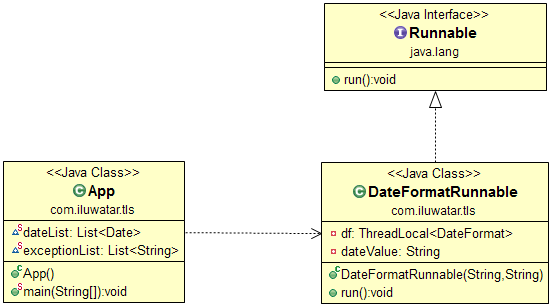

## Intent
Securing variables global to a thread against being spoiled by other threads. That is needed if you use class variables or static variables in your Callable object or Runnable object that are not read-only.

## Class diagram

## Applicability
Use the Thread Local Storage in any of the following situations

* When you use class variables in your Callable / Runnable object that are not read-only and you use the same Callable instance in more than one thread running in parallel.
* When you use static variables in your Callable / Runnable object that are not read-only and more than one instances of the Callable / Runnable may run in parallel threads.
