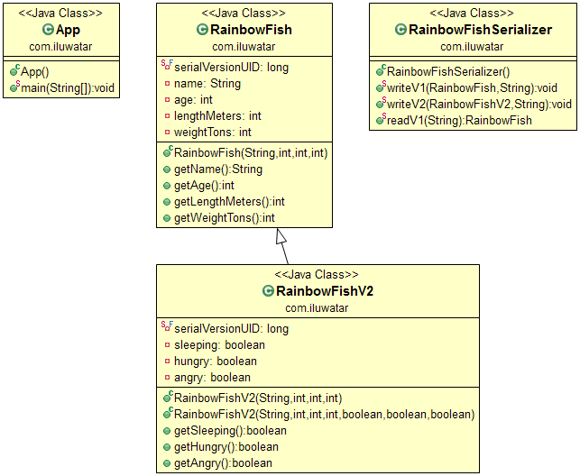

## Intent
Tolerant Reader is an integration pattern that helps creating
robust communication systems. The idea is to be as tolerant as possible when
reading data from another service. This way, when the communication schema
changes, the readers must not break.

## Applicability
Use the Tolerant Reader pattern when

* the communication schema can evolve and change and yet the receiving side should not break

## Credits

* [Martin Fowler - Tolerant Reader](http://martinfowler.com/bliki/TolerantReader.html)
