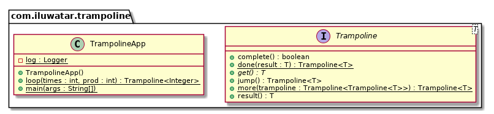

## Intent

Trampoline pattern is used for implementing algorithms recursively in Java without blowing the stack 
and to interleave the execution of functions without hard coding them together.

## Explanation

Recursion is a frequently adopted technique for solving algorithmic problems in a divide and conquer
style. For example calculating fibonacci accumulating sum and factorials. In these kinds of problems 
recursion is more straightforward than their loop counterpart. Furthermore recursion may need less 
code and looks more concise. There is a saying that every recursion problem can be solved using 
a loop with the cost of writing code that is more difficult to understand.

However recursion type solutions have one big caveat. For each recursive call it typically needs 
an intermediate value stored and there is a limited amount of stack memory available. Running out of 
stack memory creates a stack overflow error and halts the program execution.

Trampoline pattern is a trick that allows us define recursive algorithms in Java without blowing the 
stack. 

Real world example

> A recursive Fibonacci calculation without the stack overflow problem using the Trampoline pattern.       

In plain words

> Trampoline pattern allows recursion without running out of stack memory. 

Wikipedia says

> In Java, trampoline refers to using reflection to avoid using inner classes, for example in event 
> listeners. The time overhead of a reflection call is traded for the space overhead of an inner 
> class. Trampolines in Java usually involve the creation of a GenericListener to pass events to 
> an outer class.

**Programmatic Example**

Here's the `Trampoline` implementation in Java.

When `get` is called on the returned Trampoline, internally it will iterate calling `jump` on the 
returned `Trampoline` as long as the concrete instance returned is `Trampoline`, stopping once the 
returned instance is `done`.

```java
public interface Trampoline<T> {

  T get();

  default Trampoline<T> jump() {
    return this;
  }

  default T result() {
    return get();
  }

  default boolean complete() {
    return true;
  }

  static <T> Trampoline<T> done(final T result) {
    return () -> result;
  }

  static <T> Trampoline<T> more(final Trampoline<Trampoline<T>> trampoline) {
    return new Trampoline<T>() {
      @Override
      public boolean complete() {
        return false;
      }

      @Override
      public Trampoline<T> jump() {
        return trampoline.result();
      }

      @Override
      public T get() {
        return trampoline(this);
      }

      T trampoline(final Trampoline<T> trampoline) {
        return Stream.iterate(trampoline, Trampoline::jump)
            .filter(Trampoline::complete)
            .findFirst()
            .map(Trampoline::result)
            .orElseThrow();
      }
    };
  }
}
```

Using the `Trampoline` to get Fibonacci values.

```java
  public static Trampoline<Integer> loop(int times, int prod) {
    if (times == 0) {
      return Trampoline.done(prod);
    } else {
      return Trampoline.more(() -> loop(times - 1, prod * times));
    }
  }
  
  log.info("start pattern");
  var result = loop(10, 1).result();
  log.info("result {}", result);
```

Program output:

```
start pattern
result 3628800
```

## Class diagram



## Applicability

Use the Trampoline pattern when

* For implementing tail recursive function. This pattern allows to switch on a stackless operation.
* For interleaving the execution of two or more functions on the same thread.

## Known uses

* [cyclops-react](https://github.com/aol/cyclops-react)

## Credits

* [Trampolining: a practical guide for awesome Java Developers](https://medium.com/@johnmcclean/trampolining-a-practical-guide-for-awesome-java-developers-4b657d9c3076)
* [Trampoline in java ](http://mindprod.com/jgloss/trampoline.html)
* [Laziness, trampolines, monoids and other functional amenities: this is not your father's Java](https://www.slideshare.net/mariofusco/lazine)
* [Trampoline implementation](https://github.com/bodar/totallylazy/blob/master/src/com/googlecode/totallylazy/Trampoline.java)
* [What is a trampoline function?](https://stackoverflow.com/questions/189725/what-is-a-trampoline-function)
* [Modern Java in Action: Lambdas, streams, functional and reactive programming](https://www.amazon.com/gp/product/1617293563/ref=as_li_qf_asin_il_tl?ie=UTF8&tag=javadesignpat-20&creative=9325&linkCode=as2&creativeASIN=1617293563&linkId=ad53ae6f9f7c0982e759c3527bd2595c)
* [Java 8 in Action: Lambdas, Streams, and functional-style programming](https://www.amazon.com/gp/product/1617291994/ref=as_li_qf_asin_il_tl?ie=UTF8&tag=javadesignpat-20&creative=9325&linkCode=as2&creativeASIN=1617291994&linkId=e3e5665b0732c59c9d884896ffe54f4f)
