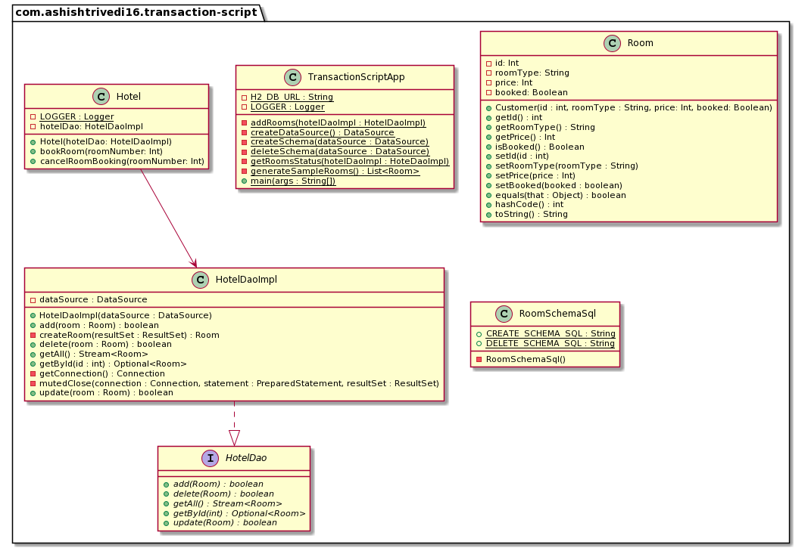

## Intent

Transaction Script organizes business logic by procedures where each procedure handles a single 
request from the presentation.

## Explanation

Real world example

> You need to create a hotel room booking system. Since the requirements are quite simple we intend 
> to use the Transaction Script pattern here.

In plain words

> Transaction Script organizes business logic into transactions that the system needs to carry out.

Programmatic example

The `Hotel` class takes care of booking and cancelling room reservations.

```java
@Slf4j
public class Hotel {

  private final HotelDaoImpl hotelDao;

  public Hotel(HotelDaoImpl hotelDao) {
    this.hotelDao = hotelDao;
  }

  public void bookRoom(int roomNumber) throws Exception {

    Optional<Room> room = hotelDao.getById(roomNumber);

    if (room.isEmpty()) {
      throw new Exception("Room number: " + roomNumber + " does not exist");
    } else {
      if (room.get().isBooked()) {
        throw new Exception("Room already booked!");
      } else {
        Room updateRoomBooking = room.get();
        updateRoomBooking.setBooked(true);
        hotelDao.update(updateRoomBooking);
      }
    }
  }

  public void cancelRoomBooking(int roomNumber) throws Exception {

    Optional<Room> room = hotelDao.getById(roomNumber);

    if (room.isEmpty()) {
      throw new Exception("Room number: " + roomNumber + " does not exist");
    } else {
      if (room.get().isBooked()) {
        Room updateRoomBooking = room.get();
        updateRoomBooking.setBooked(false);
        int refundAmount = updateRoomBooking.getPrice();
        hotelDao.update(updateRoomBooking);

        LOGGER.info("Booking cancelled for room number: " + roomNumber);
        LOGGER.info(refundAmount + " is refunded");
      } else {
        throw new Exception("No booking for the room exists");
      }
    }
  }
}
```

The `Hotel` class has two methods, one for booking and cancelling a room respectively. Each one of 
them handles a single transaction in the system, making `Hotel` implement the Transaction Script 
pattern.

The `bookRoom` method consolidates all the needed steps like checking if the room is already booked
or not, if not booked then books the room and updates the database by using the DAO. 

The `cancelRoom` method consolidates steps like checking if the room is booked or not, 
if booked then calculates the refund amount and updates the database using the DAO.

## Class diagram



## Applicability

Use the Transaction Script pattern when the application has only a small amount of logic and that 
logic won't be extended in the future.

## Consequences

* As the business logic gets more complicated, 
it gets progressively harder to keep the transaction script 
in a well-designed state.
* Code duplication between transaction scripts can occur.
* Normally not easy to refactor transactions script to other domain logic
patterns.

## Related patterns

* Domain Model
* Table Module
* Service Layer

## Credits

* [Transaction Script Pattern](https://dzone.com/articles/transaction-script-pattern#:~:text=Transaction%20Script%20(TS)%20is%20the,need%20big%20architecture%20behind%20them.)
* [Transaction Script](https://www.informit.com/articles/article.aspx?p=1398617)
* [Patterns of Enterprise Application Architecture](https://www.amazon.com/gp/product/0321127420/ref=as_li_qf_asin_il_tl?ie=UTF8&tag=javadesignpat-20&creative=9325&linkCode=as2&creativeASIN=0321127420&linkId=18acc13ba60d66690009505577c45c04)
