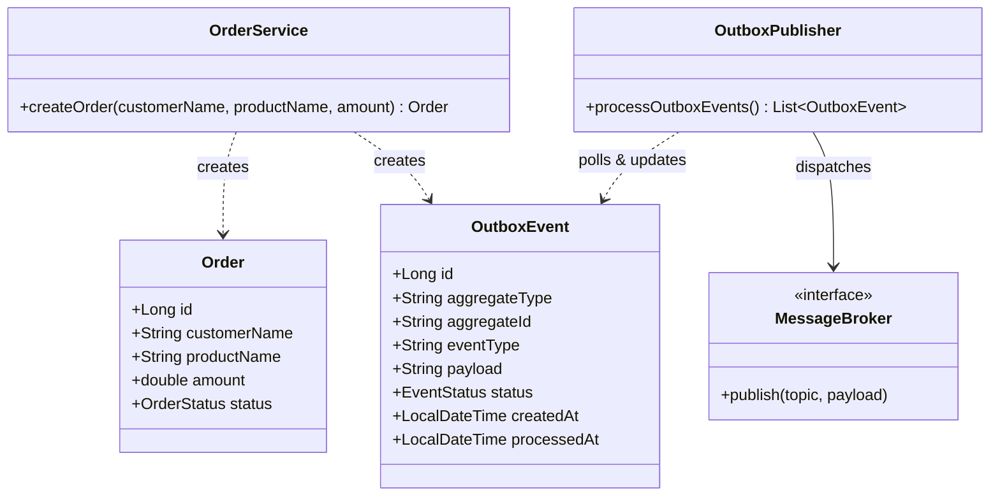

## Also known as

* Outbox Pattern
* Application Event Outbox
* Transactional Event Outbox

## Intent of Transactional Outbox Pattern

The Transactional Outbox pattern reliably publishes events in microservices architectures without requiring distributed transactions (XA/2PC). By persisting business data and event notifications in the same database transaction, it guarantees that message publishing always stays consistent with database changes.

## Detailed Explanation of the Pattern with Real-World Examples

### Real-world analogy

> Imagine writing an important contract and placing the outgoing notice into a postal outbox tray located right next to your desk in a single action. Even if the mail courier arrives later, the document is securely staged in the outbox tray and cannot be lost. A dedicated mail clerk periodically inspects the outbox tray and delivers the letters to the post office.

### In plain words

> Instead of updating the database and publishing a message directly to a message broker in two separate network calls, a service writes both the business entity and an outbox event into the database within a single database transaction. A separate background process periodically reads pending outbox events and publishes them to the message broker.

### Architecture Flow

```
+-------------------------------------------------------------+
|                      Service Boundary                       |
|                                                             |
|  +--------------------+         +------------------------+  |
|  |   Order Service    |         |   Outbox Publisher     |  |
|  +--------------------+         +------------------------+  |
|            |                                | (Polls)       |
|  (Atomic Transaction)                       v               |
|            |                    +------------------------+  |
|            +------------------> | Outbox Table (Pending) |  |
|            |                    +------------------------+  |
|            v                                | (Publishes)   |
|  +--------------------+                     v               |
|  |    Orders Table    |         +------------------------+  |
|  +--------------------+         |     Message Broker     |  |
|                                 +------------------------+  |
+-------------------------------------------------------------+
```

## Programmatic Example (Spring Boot)

### Order & Outbox Entities

The `Order` entity represents business data, while `OutboxEvent` represents the event payload staged for asynchronous publishing.

```java
@Entity
@Table(name = "orders")
@Data
@Builder
public class Order {
  @Id
  @GeneratedValue(strategy = GenerationType.IDENTITY)
  private Long id;
  private String customerName;
  private String productName;
  private double amount;
  @Enumerated(EnumType.STRING)
  private OrderStatus status;
}

@Entity
@Table(name = "outbox_events")
@Data
@Builder
public class OutboxEvent {
  @Id
  @GeneratedValue(strategy = GenerationType.IDENTITY)
  private Long id;
  private String aggregateType;
  private String aggregateId;
  private String eventType;
  private String payload;
  @Enumerated(EnumType.STRING)
  private EventStatus status;
  private LocalDateTime createdAt;
  private LocalDateTime processedAt;
}
```

### Atomic Transactional Write (`OrderService`)

The service saves the order entity and creates an outbox event in the same transactional context using Spring's `@Transactional`.

```java
@Service
@RequiredArgsConstructor
public class OrderService {

  private final OrderRepository orderRepository;
  private final OutboxRepository outboxRepository;

  @Transactional
  public Order createOrder(String customerName, String productName, double amount) {
    var order = Order.builder()
        .customerName(customerName)
        .productName(productName)
        .amount(amount)
        .status(OrderStatus.CREATED)
        .createdAt(LocalDateTime.now())
        .build();

    var savedOrder = orderRepository.save(order);

    var outboxEvent = OutboxEvent.builder()
        .aggregateType("Order")
        .aggregateId(String.valueOf(savedOrder.getId()))
        .eventType("ORDER_CREATED")
        .payload(String.format("{\"orderId\":%d,\"amount\":%.2f}", savedOrder.getId(), amount))
        .status(EventStatus.PENDING)
        .createdAt(LocalDateTime.now())
        .build();

    outboxRepository.save(outboxEvent);
    return savedOrder;
  }
}
```

### Background Polling Publisher (`OutboxPublisher`)

A scheduled background process polls `PENDING` outbox events, publishes them to the message broker, and marks their status as `PROCESSED`.

```java
@Component
@RequiredArgsConstructor
public class OutboxPublisher {

  private final OutboxRepository outboxRepository;
  private final MessageBroker messageBroker;

  @Scheduled(fixedDelay = 5000)
  @Transactional
  public void processOutboxEvents() {
    List<OutboxEvent> pendingEvents = outboxRepository.findByStatus(EventStatus.PENDING);
    for (OutboxEvent event : pendingEvents) {
      messageBroker.publish("order-events", event.getPayload());
      event.setStatus(EventStatus.PROCESSED);
      event.setProcessedAt(LocalDateTime.now());
      outboxRepository.save(event);
    }
  }
}
```

## Class Diagram



## When to Use the Transactional Outbox Pattern

Use this pattern when:

* You need to update a database and publish messages to an event broker without data loss or inconsistent dual-writes.
* Distributed transactions (XA 2-phase commit) are not supported, perform poorly, or add unwanted complexity.
* You are building event-driven microservices requiring **at-least-once** event delivery guarantees.

## Real-World Applications

* E-commerce checkout systems emitting order creation events for billing and fulfillment services.
* Financial transaction processing services issuing audit log events alongside database updates.
* Microservices using Change Data Capture (CDC) like Debezium for database log mining outbox patterns.

## Benefits and Trade-offs

### Benefits

* **No Dual-Write Inconsistency**: Prevents lost messages or phantom events caused by network/broker outages.
* **At-Least-Once Delivery**: Guarantees event delivery to message consumers.
* **No Distributed Transactions**: Avoids expensive and fragile XA/2PC transactions across services.

### Trade-Offs

* **Near Real-time Latency**: Polling intervals add slight delay before events are dispatched.
* **Duplicate Message Handling**: Consumers must implement idempotent processing to handle potential message redeliveries.
* **Outbox Table Cleanup**: Outbox entries must be periodically archived or purged to prevent uncontrolled table growth.

## Related Java Design Patterns

* [Polling Publisher](https://java-design-patterns.com/patterns/polling-publisher/)
* [Saga Pattern](https://java-design-patterns.com/patterns/saga/)
* [Idempotent Consumer](https://java-design-patterns.com/patterns/microservices-idempotent-consumer/)
* [Event-Driven Architecture](https://java-design-patterns.com/patterns/event-driven-architecture/)

## References and Credits

* [Microservices.io - Pattern: Transactional Outbox](https://microservices.io/patterns/data/transactional-outbox.html)
* [Debezium - Reliable Microservices Data Exchange With the Outbox Pattern](https://debezium.io/blog/2019/02/19/reliable-microservices-data-exchange-with-outbox-pattern/)
* [Designing Data-Intensive Applications - Martin Kleppmann](https://dataintensive.net/)
