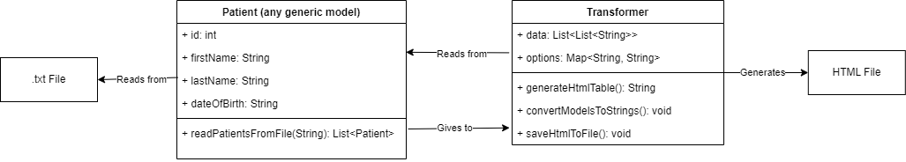

## Name
Transform View

## Intent

Convert some raw data into a presentable, formatted HTML page. This allows a user to transform data
from other sources, for example a database, or any generic file, into something that can be easily understood

## Explanation

Real-world example

> A hospital has a large list of patient records that they want to display nicely, without the
> user having to strain to check what patient is what

In plain words

> Transform view transforms some tricky to interpret data into a pretty web-page.

**Programmatic Example**

The Transformer class will be instantiated to transform instances of the Patient class. They will
be transformed into a clean looking HTML file with some customisable options for the output.


```java
public static void main(String[] args) {
    // the file name is where a .txt file is located with a list of patients
    // this is not necessary if the models/instances already exist, but it shows
    // it can be easy to move data all the way from a .txt to a nice webpage   
    // also note, this class can be anything, the transformer is generic to any model    
    List<Patient> patients = Patient.readPatientsFromFile("transform-view/src/main/java/patients.txt");

    // create a hashmap of all of the options for the output of the table
    // so you can make it look nice    
    HashMap<String, String> options = new HashMap<>();
    options.put("font-size", "20px");
    options.put("table-margin", "auto");
    options.put("cell-padding", "10px");
    options.put("column-spacing", "50px");
    options.put("border", "3px solid black");
    options.put("cell-border", "1px dashed black");
    Transformer transformer = new Transformer(options);
    transformer.convertModelsToStrings(patients, Patient.class); // this isn't necessary if you have
    // data already as lists of lists and can set it directly by going transformer.setData()

    // Generate HTML content
    String htmlContent = transformer.generateHtmlTable();

    // Save the HTML content to a file (obviously, this can be anywhere you want)
    // or in a more complicated system such as MVC, it could return a view instead of just
    // downloading a text file
    transformer.saveHtmlToFile(htmlContent, "transform-view/output/generatedTable.html");
}
```

## Class diagram



## Applicability

The Transform View pattern should be used

* To take a hard to read set of data and convert it into a nice looking webpage
* To dynamically generate content that is human readable where the content is subject to change.
For example, when multiple classes need to be transformed, or when a developer doesn't want to know
the field of every single class they need to transform.

## Tutorials

* [Practical PHP Patterns: Transform View](https://dzone.com/articles/practical-php-patterns/practical-php-patterns-10)
* [Transform View, Martin Fowler](https://www.martinfowler.com/eaaCatalog/transformView.html)

## Consequences

### Pros
* Allows for fast, visual representations of data, rather than having to look through large
databases or text files
* Fairly straightforward to setup

### Cons
* Requires some integration between the Transformer and the class that is being transformed.
This is because the Transformer requires a certain data format

## Related patterns

* Two Step View
* Template View

## Credits

* [Transform View, Martin Fowler](https://www.martinfowler.com/eaaCatalog/transformView.html)
* [Transform View Pattern, University of Canterbury](https://oowisdom.csse.canterbury.ac.nz/index.php/Transform_view_pattern)
* [Transform View Design Pattern, Ram N Java](https://www.youtube.com/watch?v=PKhMhfcZSiw)