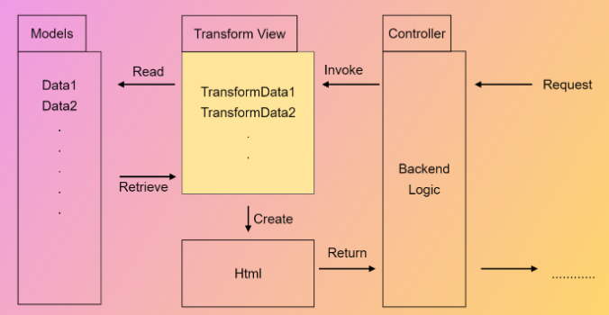

## Intent

Transform view allow users to allow users to transform data into HTML.

## Flow chart



### Model

>The xml file used to be read by the web server.

```xml
<?xml version="1.0" encoding="utf-8" standalone="no"?>
<?xml-stylesheet type="text/xsl" href="xsl.xslt"?>
<members>
    <member id="1">
        <name>YuCong</name>
        <age>18</age>
        <book>Java learn</book>
    </member>
    <member id="2">
        <name>Wenjing Wang</name>
        <age>18</age>
        <book>Java Learning</book>
    </member>
</members>
```
### Transformer
>The trasoformer used by XSLT a functional programming language to transform the XML file to HTML which will show you a table. 
```xml
<?xml version="1.0" encoding="utf-8"?>
<xsl:stylesheet version="1.0"  xmlns:xsl="http://www.w3.org/1999/XSL/Transform">
    <xsl:template match="/">
        <html>
            <head>
                <title>YuCong's Demo</title>
            </head>
            <body>
                <xsl:choose>
                    <xsl:when test="members/member">
                        <table border="1">
                            <thead>
                                <tr>
                                    <td>id</td>
                                    <td>Name</td>
                                    <td>Book</td>
                                </tr>
                            </thead>
                            <tbody>
                                <xsl:for-each select="members/member">
                                    <tr>
                                        <td>
                                            <xsl:value-of select="@id"/>
                                        </td>

                                        <td>
                                            <xsl:value-of select="name"/>
                                        </td>
                                        <td>
                                            <xsl:value-of select="book"/>
                                        </td>
                                    </tr>
                                </xsl:for-each>
                            </tbody>
                        </table>
                    </xsl:when>
                </xsl:choose>
            </body>
        </html>
    </xsl:template>
</xsl:stylesheet>


```
### Result


## Applicability
Use the Transform-view pattern when you develop similar styles of web pages.


