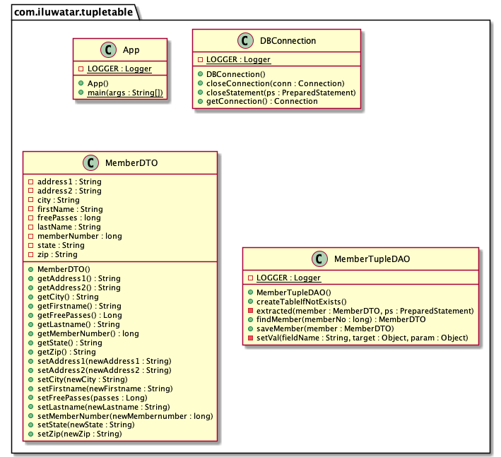

## Intent

Use Tuple table design pattern to implement to store an object (key-value pairs) in the database in flexible format.

## Explanation

The Tuple table pattern stores an object in the database in a highly flexible format that can be manipulated at the
database level by normal human beings and can be easily extended without having to convert existing data.  Much of the
data used in an enterprise application can be condensed into sets of fields. This approach can be used to persist 
objects to the database by assigning each object instance a primary key and then storing labeled values for each 
key (a tuple).

**Programmatic Example**

J2EE Design Patterns: Patterns in the Real World

> In simple applications, the fields can be stored as simple properties files, of the format

````text
name = value
othername=othervalue
````

And so forth. This approach can be used to persist objects to the database by assigning each object
instance a primary key and then storing labeled values for each key (a tuple). Rather than storing an
address in a table with ADDRESS1 column, an ADDRESS2 column, a CITY column, and so on. It might look 
like this in the database.

> sql> select address_key, fieldname, fieldvalue from addresses;

ADDRESS_KEY | FIELDNAME | FIELDVALUE
--- | --- | ---
9325 | Address1 | 10 Main St
9325 | City | Columbus
9325 | State | OH
9325 | Zip | 12345

In order to work with the result data, it can be loaded in a hash table or map the values to the fields in
an object. If required to add an Address2 field, then start adding that row to the database and update code accordingly.
If things are written properly, the database will be seamlessly upward- and backward-compatible.

**A tuple table example**
Java reflection can be used with a DAO object to retrieve an object from a tuple table or write it back to the table. By 
using reflection the filed names can be retrieved directly from the object, which is being persisted. Here is the 
structure of the table being used in the program.

> sql> desc object_data;

Field  |  Type | Null | Default
--- | --- | --- | ---  |
OBJ_PK    | int(11)      | NO   | NULL
FIELDNAME | varchar(20)  | NO   | NULL
NUMERICAL | int(11)      | YES  | NULL
STRING    | varchar(255) | YES  | NULL

The OBJECT_DATA table doesn't know about particular object types; it's counting on the application to ensure that no two
objects share a primary key. The FIELDNAME field stores the name of the field. The value of the field is stored in the
NUMERICAL or STRING fields, depending on type. If both are null, the field is assumed to be null. Having a value in 
both columns is considered to be an invalid state.

**How it works**

The program loads an object MemberDTO, describing a museum member. The findMember() method creates a new MemberDTO 
object based on a provided primary key. The saveMember() method takes a MemberDTO and saves it to the database, using 
the brute-force approach of wiping out the rows in the table for that primary key and replacing them. Also, on the Java 
side, it limits the property types to String and Long objects, although they can be extended easily. Also included a 
main() method that can be used to see how the program works.

<i>The primary advantage of this approach is extreme flexibility. By storing object fields as name and value pairs, 
the application can be modified to include new fields without changing the underlying database structure.

The primary disadvantage of the tuple table pattern is in its integrity enforcement. Relational databased are very good 
at enforcing rules at the column level, but aren't so good at enforcing rules as the data level.</i>

## Class diagram



## Applicability

Use the Table tuple pattern when

* It's required to cut the overhead of schema changes for example: storing the customer data in a tuple table means that
  even if the classes using the data need to be modified for each client (in case of client change) the underlying 
  schema can remain the same.
  

## Consequences

* When using tuple tables and reflection, it is important to remember that if the structure of the objects are changed, 
  it will require an update to the database to include the new field names. This is not much of chore: converting data 
  is generally just a simple SQL update statement, and after the development phase is over, the model should not change 
  much.
* Tuple table also exacts a performance penalty. When retrieving field data from a database table, retrieving a single 
  row containing only the field is much more efficient than retrieving several rows, each of which contains both a name 
  and a value. In addition to the extra networking overhead between the object and the database, the object must also do
  more processing. As usual, the tradeoff is between scalability and flexibility.
* There are space considerations as well: storing a label for each individual piece of data will result in a much larger
  database, although with modern disk arrays this is less of a concern than in years past.

## Credits

* [J2EE Design Patterns: Patterns in the Real World](http://ommolketab.ir/aaf-lib/axkwht7wxrhvgs2aqkxse8hihyu9zv.pdf)
* [J2EE Design Patterns by William Crawford, Jonathan Kaplan](https://www.oreilly.com/library/view/j2ee-design-patterns/0596004273/re24.html)