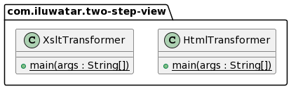

## Intent
Two-step view pattern is a design pattern that enable to turn the domain data into HTML in two steps:
1) Produces logical representation of the page which acts as a key map to value of the different elements in the page.
2) The logical representation is rendered to compose the final HTML.

## Explanation

Real-world example
> I need to remove irrelevant elements from the site which requires me to make global changes to the appearance of entire website, 
> however, I need to modify the duplicates across multiple which make this difficult. Two-step view pattern resolves this issue as 
> it would make the global change by simply altering the second stage. Therefore, I do not have to spend more time to modify
> more and more pages.

In plain words
> It turns domain data into HTML which build an intermediate representation first, then run it through a formatting step.

Wikipedia says
>Turn domain data into HTML in two steps: first by forming some kind of logical page, then rendering the logical page into HTML. 
> This makes it possible to make a global change to all output by altering the second stage, or to support multiple
> looks-and-feels by providing multiple second stages.


**Programmatic Example**

Let's take our example of remove elements from above. Consider we have a website that maintain many sites and our data could consider 
as a database that contains courseID, course description and student information. If we only cares about the student information, we 
need to transform the original XML to the filtered XML using XSL. In the `XsltTransformer` class, the original XML and XSL could consider 
as two input and able to store our output by providing the file name.

```java
public class XsltTransformer {
    
    public static void main(String[] args) {

        String xslFile ="two-step-view/src/main/xml.xslt/coursetostudent.xsl";
        String inputFile = "two-step-view/src/main/xml.xslt/course.xml";
        String outputFile = "two-step-view/src/main/xml.xslt/students.xml";

        StreamSource xsl = new StreamSource(new File(xslFile));
        StreamSource input = new StreamSource(new File(inputFile));
        StreamResult output = new StreamResult(new File(outputFile));

        TransformerFactory transformerFactory = TransformerFactory.newInstance();
        Transformer trans;
        try{
            trans = transformerFactory.newTransformer(xsl);
            trans.transform(input,output);
        } catch (TransformerConfigurationException e){
            e.printStackTrace();
        } catch (TransformerException e){
            e.printStackTrace();
        }

    }
}


```

Similar to the previous process, we then need to render the output XML from the previous stage to the HTML file. In the 
`HtmlTransformer` class, we used **students.xml** as part of our input and created another XSL file to transform into the HTML file 
which would be the new appearance of our website. 

```java
public class HtmlTransformer {

    public static void main(String[] args) {

        String xslFile ="two-step-view/src/main/xml.xslt/tohtml.xsl";
        String inputFile = "two-step-view/src/main/xml.xslt/students.xml";
        String outputFile = "two-step-view/src/main/xml.xslt/students.html";

        StreamSource xsl = new StreamSource(new File(xslFile));
        StreamSource input = new StreamSource(new File(inputFile));
        StreamResult output = new StreamResult(new File(outputFile));

        TransformerFactory transformerFactory = TransformerFactory.newInstance();
        Transformer trans;
        try{
            trans = transformerFactory.newTransformer(xsl);
            trans.transform(input,output);
        } catch (TransformerConfigurationException e){
            e.printStackTrace();
        } catch (TransformerException e){
            e.printStackTrace();
        }
    }
}

```


## Class diagram



## Applicability
Use the two-step view when

* When you want a consistent look and organization to the site for web application that maintains many pages
* When you want to make global of changes to the appearance of the websites 


## Credits
* [Patterns of Enterprise Application Architecture: Pattern Enterprise Application Architecture] (https://books.google.fi/books?id=vqTfNFDzzdIC&pg=PA365#v=onepage&q&f=false)
* [P of EAA:Two step view] (https://www.martinfowler.com/eaaCatalog/twoStepView.html)
