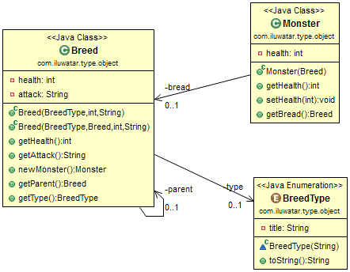

## Intent
Allow the flexible creation of new “classes” by creating a single class, each instance of which represents a different type of object.

## Applicability
This pattern is useful anytime you need to define a variety of different “kinds” of things, but baking the kinds into your language’s type system is too rigid. In particular, it’s useful when either of these is true:

*You don’t know what types you will need up front.

*You want to be able to modify or add new types without having to recompile or change code.

## Credits

* [Janka Pojtner - Type object]
