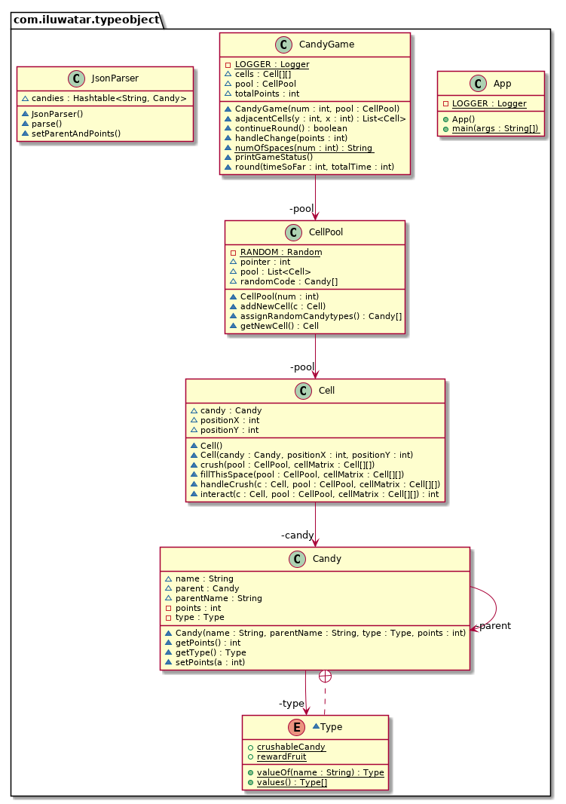

## Intent
As explained in the book Game Programming Patterns by Robert Nystrom, type object pattern helps in

> Allowing flexible creation of new “classes” by creating a single class, each instance of which represents a different type of object

## Explanation
Say, we are working on a game which has a hero and many monsters which are going to attack the hero. These monsters have certain attributes like attack, points etc. and come in different 'breeds' like zombie or ogres. The obvious answer is to have a base Monster class which has some fields and methods, which may be overriden by subclasses like the Zombie or Ogre class. But as we continue to build the game, there may be more and more breeds of monsters added and certain attributes may need to be changed in the existing monsters too. The OOP solution of inheriting from the base class would not be an efficient method in this case.
Using the type-object pattern, instead of creating many classes inheriting from a base class, we have 1 class with a field which represents the 'type' of object. This makes the code cleaner and object instantiation also becomes as easy as parsing a json file with the object properties.

## Class diagram

## Applicability
This pattern can be used when:

* We don’t know what types we will need up front.
* We want to be able to modify or add new types without having to recompile or change code.
* Only difference between the different 'types' of objects is the data, not the behaviour.
 
## Credits

* [Game Programming Patterns - Type Object](http://gameprogrammingpatterns.com/type-object.html)
* [Types as Objects Pattern](http://www.cs.sjsu.edu/~pearce/modules/patterns/analysis/top.htm)
