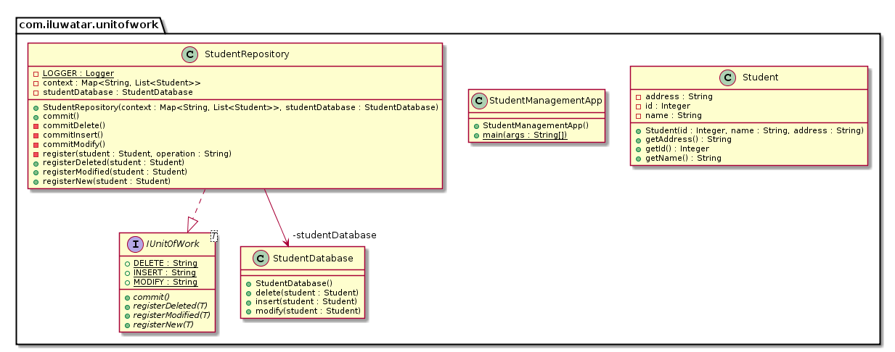

## Intent

When a business transaction is completed, all the the updates are sent as one big unit of work to be 
persisted in one go to minimize database round-trips. 

## Explanation

Real world example

> We have a database containing student information. Administrators all over the country are 
> constantly updating this information and it causes high load on the database server. To make the 
> load more manageable we apply to Unit of Work pattern to send many small updates in batches.       

In plain words

> Unit of Work merges many small database updates in single batch to optimize the number of 
> round-trips. 

[MartinFowler.com](https://martinfowler.com/eaaCatalog/unitOfWork.html) says

> Maintains a list of objects affected by a business transaction and coordinates the writing out of 
> changes and the resolution of concurrency problems.

**Programmatic Example**

Here's the `Student` entity that is being persisted to the database.

```java
public class Student {
  private final Integer id;
  private final String name;
  private final String address;

  public Student(Integer id, String name, String address) {
    this.id = id;
    this.name = name;
    this.address = address;
  }

  public String getName() {
    return name;
  }

  public Integer getId() {
    return id;
  }

  public String getAddress() {
    return address;
  }
}
```

The essence of the implementation is the `StudentRepository` implementing the Unit of Work pattern. 
It maintains a map of database operations (`context`) that need to be done and when `commit` is 
called it applies them in single batch.

```java
public interface IUnitOfWork<T> {
    
  String INSERT = "INSERT";
  String DELETE = "DELETE";
  String MODIFY = "MODIFY";

  void registerNew(T entity);

  void registerModified(T entity);

  void registerDeleted(T entity);

  void commit();
}

@Slf4j
public class StudentRepository implements IUnitOfWork<Student> {

  private final Map<String, List<Student>> context;
  private final StudentDatabase studentDatabase;

  public StudentRepository(Map<String, List<Student>> context, StudentDatabase studentDatabase) {
    this.context = context;
    this.studentDatabase = studentDatabase;
  }

  @Override
  public void registerNew(Student student) {
    LOGGER.info("Registering {} for insert in context.", student.getName());
    register(student, IUnitOfWork.INSERT);
  }

  @Override
  public void registerModified(Student student) {
    LOGGER.info("Registering {} for modify in context.", student.getName());
    register(student, IUnitOfWork.MODIFY);

  }

  @Override
  public void registerDeleted(Student student) {
    LOGGER.info("Registering {} for delete in context.", student.getName());
    register(student, IUnitOfWork.DELETE);
  }

  private void register(Student student, String operation) {
    var studentsToOperate = context.get(operation);
    if (studentsToOperate == null) {
      studentsToOperate = new ArrayList<>();
    }
    studentsToOperate.add(student);
    context.put(operation, studentsToOperate);
  }

  @Override
  public void commit() {
    if (context == null || context.size() == 0) {
      return;
    }
    LOGGER.info("Commit started");
    if (context.containsKey(IUnitOfWork.INSERT)) {
      commitInsert();
    }

    if (context.containsKey(IUnitOfWork.MODIFY)) {
      commitModify();
    }
    if (context.containsKey(IUnitOfWork.DELETE)) {
      commitDelete();
    }
    LOGGER.info("Commit finished.");
  }

  private void commitInsert() {
    var studentsToBeInserted = context.get(IUnitOfWork.INSERT);
    for (var student : studentsToBeInserted) {
      LOGGER.info("Saving {} to database.", student.getName());
      studentDatabase.insert(student);
    }
  }

  private void commitModify() {
    var modifiedStudents = context.get(IUnitOfWork.MODIFY);
    for (var student : modifiedStudents) {
      LOGGER.info("Modifying {} to database.", student.getName());
      studentDatabase.modify(student);
    }
  }

  private void commitDelete() {
    var deletedStudents = context.get(IUnitOfWork.DELETE);
    for (var student : deletedStudents) {
      LOGGER.info("Deleting {} to database.", student.getName());
      studentDatabase.delete(student);
    }
  }
}
```

Finally, here's how we use the `StudentRepository` and `commit` the transaction.

```java
    studentRepository.registerNew(ram);
    studentRepository.registerModified(shyam);
    studentRepository.registerDeleted(gopi);
    studentRepository.commit();
```

## Class diagram



## Applicability

Use the Unit Of Work pattern when

* To optimize the time taken for database transactions.
* To send changes to database as a unit of work which ensures atomicity of the transaction.
* To reduce number of database calls.

## Tutorials

* [Repository and Unit of Work Pattern](https://www.programmingwithwolfgang.com/repository-and-unit-of-work-pattern/)
* [Unit of Work - a Design Pattern](https://mono.software/2017/01/13/unit-of-work-a-design-pattern/)

## Credits

* [Design Pattern - Unit Of Work Pattern](https://www.codeproject.com/Articles/581487/Unit-of-Work-Design-Pattern)
* [Unit Of Work](https://martinfowler.com/eaaCatalog/unitOfWork.html)
* [Patterns of Enterprise Application Architecture](https://www.amazon.com/gp/product/0321127420/ref=as_li_tl?ie=UTF8&camp=1789&creative=9325&creativeASIN=0321127420&linkCode=as2&tag=javadesignpat-20&linkId=d9f7d37b032ca6e96253562d075fcc4a)
