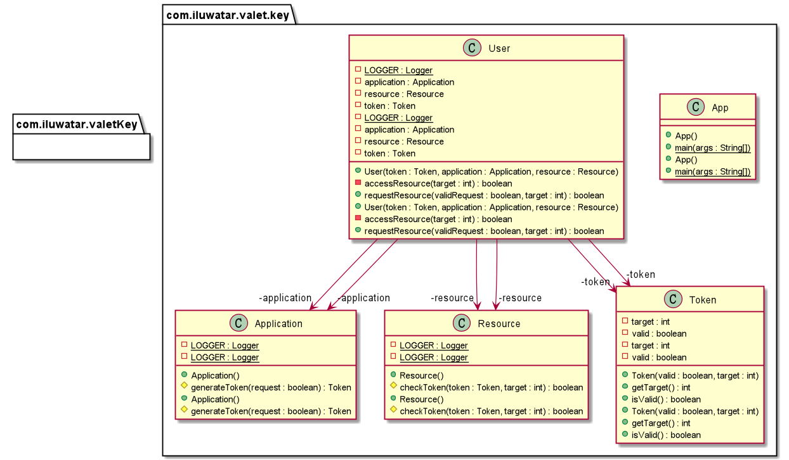

## Intent

Use a token that provides clients with restricted direct access to a specific resource, in order to offload data transfer from the application.

## Explanation

Real world example

> User requests a source from target database. The user access the resource directly by using a token generated by application.

In plain words

> Valet Key pattern can minimize cost and maximize scalability and performance.

**Programmatic Example**

This is the user who want to request a resource. At first, the user send a request to application to get a token. Then he will use the token to access data directly.

```java
public class User {
  private Token token;
  private final Application application;
  private final Resource resource;

  /**
   * request a source in target database.
   *
   * @param validRequest is the request valid.
   * @param target the target position of resource.
   * @return is it access successfully.
   */
  public boolean requestResource(boolean validRequest, int target) {
    LOGGER.info("request a resource");
    if (token == null || !token.isValid()) {
      token = application.generateToken(validRequest);
    }

    return accessResource(target);
  }

  private boolean accessResource(int target) {
    if (resource.checkToken(token, target)) {
      LOGGER.info("Access Resource successfully");
      return true;
    } else {
      LOGGER.info("Access Resource failed");
      return false;
    }
  }
}
```

This is the application which user use. Instead of returning data, it generate a token for the user if the request is valid.

```java
public class Application {
  protected Token generateToken(boolean request) {
    if (request) {
      LOGGER.info("the request is invalid, generate token successfully");
    } else {
      LOGGER.info("the request is valid, generate token failed");
    }

    int target = 1;
    return new Token(request, target);
  }
}
```

This is resource which user want to access. The user can access data successfully if his token is valid and has right of corresponding resource.

```java
public class Resource {
  protected boolean checkToken(Token token, int target) {
    if (token.isValid() && token.getTarget() == target) {
      LOGGER.info("Token is valid");
      return true;
    } else {
      LOGGER.info("Token is invalid or No access rights");
      return false;
    }
  }
}
```


## Class diagram



## Applicability

Use the Valet Key pattern when

* To minimize resource loading and maximize performance and scalability. Using a valet key doesn't require the resource to be locked, no remote server call is required, there's no limit on the number of valet keys that can be issued, and it avoids a single point of failure resulting from performing the data transfer through the application code. Creating a valet key is typically a simple cryptographic operation of signing a string with a key.
* To minimize operational cost. Enabling direct access to stores and queues is resource and cost efficient, can result in fewer network round trips, and might allow for a reduction in the number of compute resources required.
* When clients regularly upload or download data, particularly where there's a large volume or when each operation involves large files.
* When the application has limited compute resources available, either due to hosting limitations or cost considerations. In this scenario, the pattern is even more helpful if there are many concurrent data uploads or downloads because it relieves the application from handling the data transfer.
* When the data is stored in a remote data store or a different datacenter. If the application was required to act as a gatekeeper, there might be a charge for the additional bandwidth of transferring the data between datacenters, or across public or private networks between the client and the application, and then between the application and the data store.

## Credits

* [Valet Key pattern](https://docs.microsoft.com/en-us/azure/architecture/patterns/valet-key)

