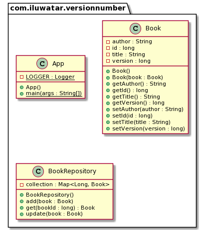

## Name / classification

Version Number.

## Also known as

Entity Versioning, Optimistic Locking.

## Intent

Resolve concurrency conflicts when multiple clients are trying to update same entity simultaneously.

## Explanation

Real world example

> Alice and Bob are working on the book, which stored in the database. Our heroes are making
> changes simultaneously, and we need some mechanism to prevent them from overwriting each other.

In plain words

> Version Number pattern grants protection against concurrent updates to same entity.

Wikipedia says

> Optimistic concurrency control assumes that multiple transactions can frequently complete
> without interfering with each other. While running, transactions use data resources without
> acquiring locks on those resources. Before committing, each transaction verifies that no other
> transaction has modified the data it has read. If the check reveals conflicting modifications,
> the committing transaction rolls back and can be restarted.

**Programmatic Example**

We have a `Book` entity, which is versioned, and has a copy-constructor:

```java
public class Book {
  private long id;
  private String title = "";
  private String author = "";

  private long version = 0; // version number

  public Book(Book book) {
    this.id = book.id;
    this.title = book.title;
    this.author = book.author;
    this.version = book.version;
  }

  // getters and setters are omitted here
}
```

We also have `BookRepository`, which implements concurrency control:

```java
public class BookRepository {
  private final Map<Long, Book> collection = new HashMap<>();

  public void update(Book book) throws BookNotFoundException, VersionMismatchException {
    if (!collection.containsKey(book.getId())) {
      throw new BookNotFoundException("Not found book with id: " + book.getId());
    }

    var latestBook = collection.get(book.getId());
    if (book.getVersion() != latestBook.getVersion()) {
      throw new VersionMismatchException(
        "Tried to update stale version " + book.getVersion()
          + " while actual version is " + latestBook.getVersion()
      );
    }

    // update version, including client representation - modify by reference here
    book.setVersion(book.getVersion() + 1);

    // save book copy to repository
    collection.put(book.getId(), new Book(book));
  }

  public Book get(long bookId) throws BookNotFoundException {
    if (!collection.containsKey(bookId)) {
      throw new BookNotFoundException("Not found book with id: " + bookId);
    }

    // return copy of the book
    return new Book(collection.get(bookId));
  }
}
```

Here's the concurrency control in action:

```java
var bookId = 1;
// Alice and Bob took the book concurrently
final var aliceBook = bookRepository.get(bookId);
final var bobBook = bookRepository.get(bookId);

aliceBook.setTitle("Kama Sutra"); // Alice has updated book title
bookRepository.update(aliceBook); // and successfully saved book in database
LOGGER.info("Alice updates the book with new version {}", aliceBook.getVersion());

// now Bob has the stale version of the book with empty title and version = 0
// while actual book in database has filled title and version = 1
bobBook.setAuthor("Vatsyayana Mallanaga"); // Bob updates the author
try {
  LOGGER.info("Bob tries to update the book with his version {}", bobBook.getVersion());
  bookRepository.update(bobBook); // Bob tries to save his book to database
} catch (VersionMismatchException e) {
  // Bob update fails, and book in repository remained untouchable
  LOGGER.info("Exception: {}", e.getMessage());
  // Now Bob should reread actual book from repository, do his changes again and save again
}
```

Program output:

```java
Alice updates the book with new version 1
Bob tries to update the book with his version 0
Exception: Tried to update stale version 0 while actual version is 1
```

## Class diagram



## Applicability

Use Version Number for:

* resolving concurrent write-access to the data
* strong data consistency

## Tutorials
* [Version Number Pattern Tutorial](http://www.java2s.com/Tutorial/Java/0355__JPA/VersioningEntity.htm)

## Known uses
 * [Hibernate](https://vladmihalcea.com/jpa-entity-version-property-hibernate/)
 * [Elasticsearch](https://www.elastic.co/guide/en/elasticsearch/reference/current/docs-index_.html#index-versioning)
 * [Apache Solr](https://lucene.apache.org/solr/guide/6_6/updating-parts-of-documents.html)

## Consequences
Version Number pattern allows to implement a concurrency control, which is usually done
via Optimistic Offline Lock pattern.

## Related patterns
* [Optimistic Offline Lock](https://martinfowler.com/eaaCatalog/optimisticOfflineLock.html)

## Credits
* [Optimistic Locking in JPA](https://www.baeldung.com/jpa-optimistic-locking)
* [JPA entity versioning](https://www.byteslounge.com/tutorials/jpa-entity-versioning-version-and-optimistic-locking)
* [J2EE Design Patterns](http://ommolketab.ir/aaf-lib/axkwht7wxrhvgs2aqkxse8hihyu9zv.pdf)
