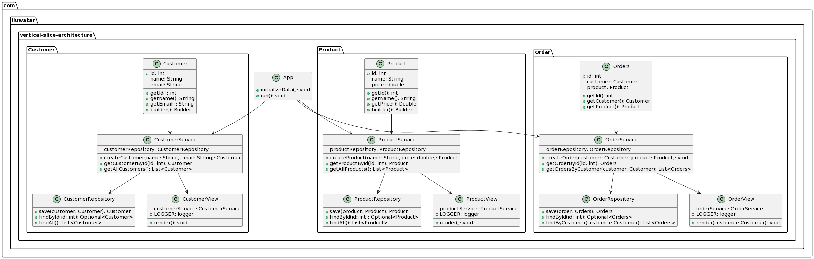

## Intent

Organize the application according to its features.
Each feature will comprise its distinct set of layers (Models, Services, Repository, and Controllers).

## Explanation

Real-World Examples (Consider E-commerce)

> In the context of an e-commerce application, the concept of vertical slice architecture becomes clear.
> Imagine you're building a backend service for an online store.
> Initially, you may organize it with the typical grouping of controllers, models, and other components.
> As the application grows, the need arises to implement new features.

> For instance, you might have distinct layers for orders, customers, and products. However, as the application
> evolves, you realize the necessity of integrating additional features like a Cart system and wishlists.
> At this point, integrating these new features into the existing structure becomes challenging.
> It demands significant dependency modifications and mocking, which can be time-consuming and error-prone.

> This is where vertical slice architecture proves its value. 
> By structuring the application based on features,
> you create self-contained modules that encapsulate all the necessary components
> (Models, Services, Repository, and Controllers) for a particular feature.
> When you need to add new features, you can do so in a more isolated and manageable manner.

In Plain Words

> Vertical slice architecture is like organizing your toolbox.
> Instead of having all your tools mixed together, you group them based on the type of task they perform.
> This way, when you need a specific tool for a particular job,
> you can quickly find it without rummaging through a jumble of items.

> Similarly, in software development, vertical slice architecture involves organizing the codebase based on features. 
> Each feature has its own self-contained set of components, making it easier to add, modify, or remove features without disrupting the entire application.

**File structure**
> have a look in the below file structure, as per vertical slice architecture we are grouping model, view and controller per package associated with the feature.

```
- ecommerce
  ├── customer
  │   ├── Customer.java
  │   ├── CustomerRepository.java
  │   ├── CustomerService.java
  │   └── CustomerView.java
  ├── order
  │   ├── Orders.java
  │   ├── OrderRepository.java
  │   ├── OrderService.java
  │   └── OrderView.java
  ├── product
  │   ├── Product.java
  │   ├── ProductRepository.java
  │   ├── ProductService.java
  │   └── ProductView.java
  └── App.java
```

## Class diagram



## Applicability

Use Vertical Slice Architecture when

* You want future modification ( new addition of features ).
* You want to reduce the amount of mocking.
* You want to make it more modular by feature.

## Resources

* [How to Implement Vertical Slice Architecture by Gary Woodfine](https://garywoodfine.com/implementing-vertical-slice-architecture/)
* [youtube](https://www.youtube.com/watch?v=B1d95I7-zsw)
* [medium](https://medium.com/sahibinden-technology/package-by-layer-vs-package-by-feature-7e89cde2ae3a)
* [A reference application](https://github.com/sugan0tech/Event-Manager)
