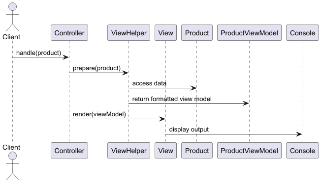

## Intent of View Helper Design Pattern
The View Helper Design Pattern separates presentation logic from the view by delegating complex UI tasks — like formatting or conditional display — to reusable helper components. This keeps views clean, promotes reuse, and aligns with the MVC principle of separating concerns between the view and the business logic.

## Detailed Explanation with Real‑World Analogy
Real‑world example
> Imagine you're putting together a slideshow for a business presentation. You focus on arranging the slides, choosing the layout, and telling the story. But for tasks like resizing images, formatting charts, or converting data into visual form, you use tools or templates that automate those parts.
>
> In this analogy, you are the view, and the tools/templates are the helpers. They handle the heavy lifting behind the scenes so you can concentrate on the presentation. Similarly, in the View Helper pattern, the view delegates logic-heavy tasks—such as formatting or conditionally displaying data—to helper classes, keeping the view layer clean and presentation-focused.

### In plain words
> The View Helper pattern is about keeping your UI code clean by moving any logic—like formatting, calculations, or decision-making—into separate helper classes. Instead of stuffing all the logic into the HTML or template files, you delegate it to helpers, so the view just focuses on showing the final result.

### Sequence diagram


## Programmatic Example of View Helper Pattern in Java
Raw domain object
```java
public record Product(String name, BigDecimal price, LocalDate releaseDate, boolean discounted) {}
```

View model object for display
```java
public record ProductViewModel(String name, String price, String releasedDate) {}
```

View Helper formats data for display
```java
class ProductViewHelper implements ViewHelper<Product, ProductViewModel> {
  
  private static final String DISCOUNT_TAG = " (ON SALE)";
  
  public ProductViewModel prepare(Product product) {
    var displayName = product.name() + (product.discounted() ? DISCOUNT_TAG : "");
    var priceWithCurrency = NumberFormat.getCurrencyInstance(US).format(product.price());
    var formattedDate = product.releaseDate().format(ISO_DATE);

    return new ProductViewModel(displayName, priceWithCurrency, formattedDate);
  }
}
```

View renders the formatted data
```java
public class ConsoleProductView implements View<ProductViewModel> {
  
  @Override
  public void render(ProductViewModel productViewModel) {
    LOGGER.info(productViewModel.toString());
  }
}
```
The `App.java` class simulates how the View Helper pattern works in a real application. It starts with a raw `Product` object containing unformatted data. 
Then it:
1. Initializes a helper (`ProductViewHelper`) to format the product data for display.
1. Creates a view (`ConsoleProductView`) to render the formatted data.
1. Uses a controller (`ProductController`) to coordinate the flow between raw data, helper logic, and view rendering.

Finally, it simulates a user request by passing the product to the controller, which prepares the view model using the helper and displays it using the view. This demonstrates a clean separation between data, presentation logic, and rendering.

## When to Use the View Helper Pattern in Java
Use the View Helper pattern when your view layer starts containing logic such as formatting data, applying conditional styles, or transforming domain objects for display. It's especially useful in MVC architectures where you want to keep views clean and focused on rendering, while delegating non-trivial presentation logic to reusable helper classes. This pattern helps improve maintainability, testability, and separation of concerns in your application's UI layer.

## Real‑World Uses of View Helper Pattern in Java
The View Helper pattern is widely used in web frameworks that follow the MVC architecture. In Java-based web applications (e.g., JSP, Spring MVC), it's common to use helper classes or utility methods to format dates, currencies, or apply conditional logic before rendering views. Technologies like Thymeleaf or JSF often rely on custom tags or expression helpers to achieve the same effect.

## Benefits and Trade‑offs
Benefits:
* Separation of concerns: Keeps view templates clean by moving logic into dedicated helpers.
* Reusability: Common formatting and display logic can be reused across multiple views.
* Improved maintainability: Easier to update presentation logic without touching the view.
* Testability: Helpers can be unit tested independently from the UI layer.

Trade‑offs:
* Added complexity: Introduces extra classes, which may feel unnecessary for very simple views.
* Overuse risk: Excessive use of helpers can spread logic thinly across many files, making it harder to trace behavior.
* Tight coupling risk: If not designed carefully, helpers can become tightly coupled to specific views or data formats.

## Related Java Design Patterns
* [Model-View-Controller (MVC)](https://java-design-patterns.com/patterns/model-view-controller/): View Helper supports the View layer in MVC by offloading logic from the view to helper classes.
* [Template Method](https://java-design-patterns.com/patterns/template-method/): Can structure the steps of rendering or data transformation, with helpers handling specific formatting tasks.
* [Data Transfer Object (DTO)](https://java-design-patterns.com/patterns/data-transfer-object/): Often used alongside View Helper when transferring raw data that needs formatting before being displayed.

## References & Credits
* [Core J2EE Patterns: View Helper.](https://www.oracle.com/java/technologies/viewhelper.html)
