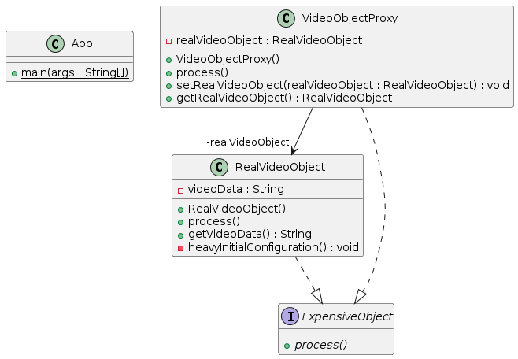

## Also known as

Surrogate

## Intent

Provide a surrogate or placeholder for another object to control its creation and access, particularly when dealing with resource-intensive operations.

## Explanation

Real-world example

> Consider an online video streaming platform where video objects are resource-intensive due to their large data size and required processing power. To efficiently manage resources, the system uses a virtual proxy to handle video objects. The virtual proxy defers the creation of actual video objects until they are explicitly required for playback, thus saving system resources and improving response times for users.

In plain words

> The virtual proxy pattern allows a representative class to stand in for another class to control access to it, particularly for resource-intensive operations.

**Programmatic Example**

Given our example of a video streaming service, here is how it might be implemented:

First, we define an `ExpensiveObject` interface, which outlines the method for processing video.

```java
public interface ExpensiveObject {
    void process();
}
```

Here’s the implementation of a `RealVideoObject` that represents an expensive-to-create video object.

```java
@Getter
public class RealVideoObject implements ExpensiveObject {
    private String videoData; 

    public RealVideoObject() {
        this.videoData = heavyInitialConfiguration();
    }

    private String heavyInitialConfiguration() {
        System.out.println("Loading video data from the database or heavy computation...");
        return "Some loaded video data";
    }

    @Override
    public void process() {
        System.out.println("Playing video content with data: " + videoData);
    }
}
```

The `VideoObjectProxy` serves as a stand-in for `RealExpensiveObject`.

```java
@Getter
public class VideoObjectProxy implements ExpensiveObject {
    private RealVideoObject realVideoObject;

    public void setRealVideoObject(RealVideoObject realVideoObject) {
        this.realVideoObject = realVideoObject;
    }

    @Override
    public void process() {
        if (realVideoObject == null) {
            System.out.println("RealVideoObject is created on demand.");
            realVideoObject = new RealVideoObject();
        }
        realVideoObject.process();
    }
}
```

And here’s how the proxy is used in the system.

```
ExpensiveObject object = new VirtualProxy();
        object.process();  // The real object is created at this point
        object.process();  // Uses the already created object
```

Program output:

```
Creating RealExpensiveObject only when it is needed.
Processing and playing video content...
Processing and playing video content...
```

## Class diagram



## Applicability

The virtual proxy pattern is useful when:

* Object creation is resource-intensive, and not all instances are utilized immediately or ever.
* The performance of a system can be significantly improved by deferring the creation of objects until they are needed.
* There is a need for control over resource usage in systems dealing with large quantities of high-overhead objects.

The virtual proxy pattern is typically used to:

* Lazy Initialization: Create objects only when they are actually needed.
* Resource Management: Efficiently manage resources by creating heavy objects only on demand.
* Access Control: Include logic to check conditions before delegating calls to the actual object.
* Performance Optimization: Incorporate caching of results or states that are expensive to obtain or compute.
* Data Binding and Integration: Delay integration and binding processes until the data is actually needed.

## Related patterns

* [Proxy](https://github.com/iluwatar/java-design-patterns/tree/master/proxy)

## Credits

* [The Proxy Pattern in Java](https://www.baeldung.com/java-proxy-pattern)
* [What is the virtual proxy design pattern?](https://www.educative.io/answers/what-is-the-virtual-proxy-design-pattern)
