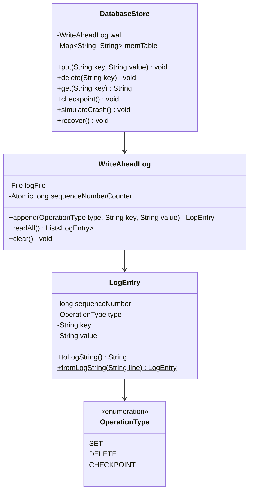

## Also known as

* Append-Only Log
* Redo Log
* Journaling

## Intent of Write-Ahead Log Pattern

The Write-Ahead Log (WAL) design pattern ensures data durability and system recoverability in database engines, distributed consensus protocols, and transactional systems. It enforces a strict order of operations where any state mutation (e.g., insert, update, delete) must be written sequentially to an append-only log file on stable storage (disk) before it is applied to the main database state or in-memory storage structures.

## Detailed Explanation of Write-Ahead Log Pattern with Real-World Examples

Real-world example

> Imagine an accountant managing a company's ledger. Before modifying the main financial summary balance sheets, the accountant immediately records every incoming transaction line-by-line into a sequential physical logbook. If power cuts out mid-day or the summary balance sheets are damaged, the accountant can re-open the physical logbook, replay every recorded entry from the beginning, and perfectly recalculate the final financial state.

In plain words

> Write-Ahead Log guarantees that no state mutation is lost during sudden system crashes by writing changes to a fast append-only disk log file before updating the in-memory store.

Wikipedia says

> In computer science, write-ahead logging (WAL) is a family of techniques for providing atomicity and durability (two of the ACID properties) in database systems. In a system using WAL, all modifications are written to a log before they are applied. Usually both redo and undo information are stored in the log.

Class Diagram



## Programmatic Example of Write-Ahead Log Pattern in Java

The `WriteAheadLog` class manages append-only sequential writes to disk:

```java
public class WriteAheadLog {
  private final File logFile;
  private final AtomicLong sequenceNumberCounter = new AtomicLong(0);

  public synchronized LogEntry append(OperationType type, String key, String value) throws IOException {
    long nextSeq = sequenceNumberCounter.incrementAndGet();
    LogEntry entry = new LogEntry(nextSeq, type, key, value);

    try (BufferedWriter writer = new BufferedWriter(new FileWriter(logFile, true))) {
      writer.write(entry.toLogString());
      writer.newLine();
      writer.flush();
    }
    return entry;
  }
}
```

The `DatabaseStore` class coordinates writing to the log before modifying its in-memory `MemTable`:

```java
public class DatabaseStore {
  private final WriteAheadLog wal;
  private final Map<String, String> memTable = new HashMap<>();

  public synchronized void put(String key, String value) throws IOException {
    wal.append(OperationType.SET, key, value);
    memTable.put(key, value);
  }

  public synchronized void delete(String key) throws IOException {
    wal.append(OperationType.DELETE, key, null);
    memTable.remove(key);
  }

  public synchronized void recover() {
    memTable.clear();
    List<LogEntry> entries = wal.readAll();
    for (LogEntry entry : entries) {
      if (entry.getType() == OperationType.SET) {
        memTable.put(entry.getKey(), entry.getValue());
      } else if (entry.getType() == OperationType.DELETE) {
        memTable.remove(entry.getKey());
      }
    }
  }
}
```

The `App` class demonstrates initialization, writes, crash simulation, and WAL recovery:

```java
@Slf4j
public class App {
  public static void main(String[] args) {
    try {
      File logFile = File.createTempFile("wal_demo", ".log");
      WriteAheadLog wal = new WriteAheadLog(logFile);
      DatabaseStore store = new DatabaseStore(wal);

      store.put("user:101", "Alice");
      store.put("user:102", "Bob");
      store.delete("user:103");

      // Simulating system crash where in-memory state is lost
      store.simulateCrash();

      // System reboot & recovery from WAL log replay
      store.recover();

      LOGGER.info("MemTable post recovery: {}", store.getMemTableSnapshot());
    } catch (IOException e) {
      LOGGER.error("Error running WAL demo", e);
    }
  }
}
```

Program output:

```text
15:45:00.100 [main] INFO com.iluwatar.writeaheadlog.App -- === 1. Initializing Storage Engine with WAL ===
15:45:00.105 [main] INFO com.iluwatar.writeaheadlog.WriteAheadLog -- WAL Entry appended & flushed to disk: LogEntry(sequenceNumber=1, type=SET, key=user:101, value=Alice)
15:45:00.106 [main] INFO com.iluwatar.writeaheadlog.DatabaseStore -- Applied SET operation to MemTable: user:101 = Alice
15:45:00.107 [main] INFO com.iluwatar.writeaheadlog.App -- === 3. Simulating Unexpected System Crash ===
15:45:00.108 [main] INFO com.iluwatar.writeaheadlog.DatabaseStore -- !!! SIMULATED SYSTEM CRASH: In-memory MemTable has been wiped !!!
15:45:00.109 [main] INFO com.iluwatar.writeaheadlog.App -- === 4. System Restart & Recovery from WAL ===
15:45:00.110 [main] INFO com.iluwatar.writeaheadlog.DatabaseStore -- Starting recovery process from WAL...
15:45:00.112 [main] INFO com.iluwatar.writeaheadlog.DatabaseStore -- Recovery completed. Replayed 5 log entries into MemTable.
15:45:00.113 [main] INFO com.iluwatar.writeaheadlog.App -- MemTable snapshot post recovery: {user:101=Alice, user:102=Bob Smith}
```

## When to Use the Write-Ahead Log Pattern in Java

* Building storage engines or key-value data stores requiring ACID durability guarantees.
* Implementing fault-tolerant distributed consensus protocols (e.g., Raft, Paxos).
* System architectures where random disk I/O is expensive, allowing sequential append-only writes for maximum throughput.
* Message brokers or event streams requiring replayability after failure.

## Real-World Applications of Write-Ahead Log Pattern in Java

* **PostgreSQL / MySQL (InnoDB):** Uses WAL / Redo Log for crash recovery and replication.
* **SQLite:** Write-Ahead Logging mode for concurrency and atomic commits.
* **Apache Cassandra / RocksDB:** Appends mutations to CommitLog / WAL before MemTable updates.
* **Apache Kafka / Raft:** Log replication across distributed nodes for consensus and state machine replication.

## Benefits and Trade-offs of Write-Ahead Log Pattern

Benefits:

* **High Performance:** Sequential disk writes are significantly faster than random disk updates (e.g., updating B-Trees directly).
* **Durability & Fault Tolerance:** Guarantees no committed transaction is lost during sudden system crashes.
* **Simplicity of Recovery:** Replaying ordered log records deterministically restores the exact last-known state.

Trade-offs:

* **Storage Overhead:** Log files grow over time, requiring periodic checkpointing and log truncation.
* **Recovery Time:** Large log files without checkpoints can lead to slow startup/recovery times.

## Related Java Design Patterns

* [Event Sourcing](https://java-design-patterns.com/patterns/event-sourcing/): Captures state mutations as a sequence of events, similar to log replay.
* [Command](https://java-design-patterns.com/patterns/command/): Encapsulates requests as objects, which can be serialized into WAL entries.
* [Memento](https://java-design-patterns.com/patterns/memento/): Stores state snapshots (checkpoints) to truncate logs.

## References and Credits

* [Designing Data-Intensive Applications (Martin Kleppmann)](https://www.oreilly.com/library/view/designing-data-intensive-applications/9781491903063/)
* [PostgreSQL Documentation: Write-Ahead Logging (WAL)](https://www.postgresql.org/docs/current/wal-intro.html)
* [Raft Consensus Algorithm Paper](https://raft.github.io/)
