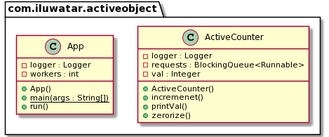

## 目的
活动对象设计模式使每个驻留在其控制线程中的对象的方法执行与方法调用脱钩。 目的是通过使用异步方法调用和用于处理请求的调度程序来引入并发。

## 解释

实现活动对象模式的类将包含自同步机制，而无需使用“同步”方法。

真实世界例子

>兽人以其野性和顽强的灵魂而著称。 似乎他们有基于先前行为的控制线程。

要实现具有自己的控制机制线程并仅公开其API而不公开自己的执行，我们可以使用活动对象模式。

**程序示例**

```java
public abstract class ActiveCreature{
  private final Logger logger = LoggerFactory.getLogger(ActiveCreature.class.getName());

  private BlockingQueue<Runnable> requests;
  
  private String name;
  
  private Thread thread;

  public ActiveCreature(String name) {
    this.name = name;
    this.requests = new LinkedBlockingQueue<Runnable>();
    thread = new Thread(new Runnable() {
        @Override
        public void run() {
          while (true) {
            try {
              requests.take().run();
            } catch (InterruptedException e) { 
              logger.error(e.getMessage());
            }
          }
        }
      }
    );
    thread.start();
  }
  
  public void eat() throws InterruptedException {
    requests.put(new Runnable() {
        @Override
        public void run() { 
          logger.info("{} is eating!",name());
          logger.info("{} has finished eating!",name());
        }
      }
    );
  }

  public void roam() throws InterruptedException {
    requests.put(new Runnable() {
        @Override
        public void run() { 
          logger.info("{} has started to roam and the wastelands.",name());
        }
      }
    );
  }
  
  public String name() {
    return this.name;
  }
}
```

我们可以看到，任何将扩展ActiveCreature的类都将具有自己的控制线程来执行和调用方法。

例如，兽人类：

```java
public class Orc extends ActiveCreature {

  public Orc(String name) {
    super(name);
  }

}
```

现在，我们可以创建多个生物，例如兽人，告诉他们吃东西和散步，然后他们将在自己的控制线程上执行它：

```java
  public static void main(String[] args) {  
    var app = new App();
    app.run();
  }
  
  @Override
  public void run() {
    ActiveCreature creature;
    try {
      for (int i = 0;i < creatures;i++) {
        creature = new Orc(Orc.class.getSimpleName().toString() + i);
        creature.eat();
        creature.roam();
      }
      Thread.sleep(1000);
    } catch (InterruptedException e) {
      logger.error(e.getMessage());
    }
    Runtime.getRuntime().exit(1);
  }
```

## 类图


